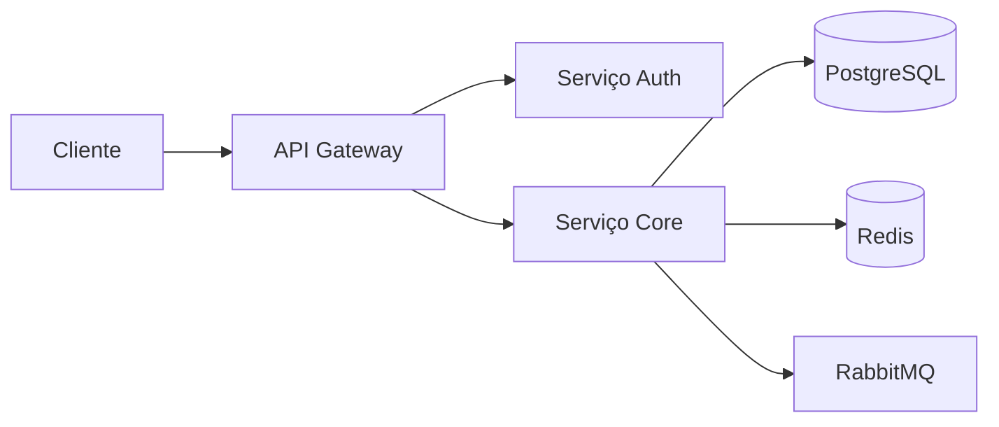

# Batch inference

**Produto:** AIRich AI Assistant | **Departamento:** Produtos | **Data:** 2026-06-03 | **Versão:** 1.6

---

## Visão Geral

Este documento fornece uma visão detalhada sobre Batch inference no ecossistema AIRich.

Como parte do programa de melhoria contínua da AIRich, Batch inference foi estruturado para atender às necessidades de escalabilidade, segurança e performance exigidas pelo mercado.

## Arquitetura

## Procedimento

O procedimento padrão para esta atividade segue as seguintes etapas:

1. **Identificação** — Reconhecer o escopo e os requisitos necessários
2. **Planejamento** — Definir recursos, cronograma e responsabilidades
3. **Execução** — Implementar conforme as especificações técnicas
4. **Validação** — Verificar se os resultados atendem aos critérios de aceite
5. **Documentação** — Registrar todas as ações e decisões tomadas

## Infraestrutura

| Ambiente | URL | Status | Responsável |
|---------|-----|--------|-----------|
| Produção | app.airich.com | Ativo | SRE |
| Staging | staging.airich.com | Ativo | DevOps |
| Dev | dev.airich.com | Ativo | Engenharia |
| QA | qa.airich.com | Ativo | QA Lead |

## Troubleshooting

### Problema: Falha na execução

**Sintoma:** O processo apresenta erro inesperado durante a execução.

**Causas possíveis:**
- Configuração incorreta do ambiente
- Dependência externa indisponível
- Limite de recursos atingido

**Solução:**
1. Verificar logs do sistema
2. Confirmar conectividade com serviços dependentes
3. Reiniciar o serviço se necessário
4. Escalar para o time de SRE se o problema persistir

## Segurança

- **Transporte:** TLS 1.3 obrigatório para todas as comunicações
- **Autenticação:** JWT com rotação automática de chaves
- **Autorização:** RBAC com granularidade por recurso
- **Auditoria:** Log imutável de todas as operações sensíveis
- **Criptografia:** AES-256 para dados sensíveis em repouso

---

*Documento mantido pela equipe de Produtos — AIRich Tecnologia*
