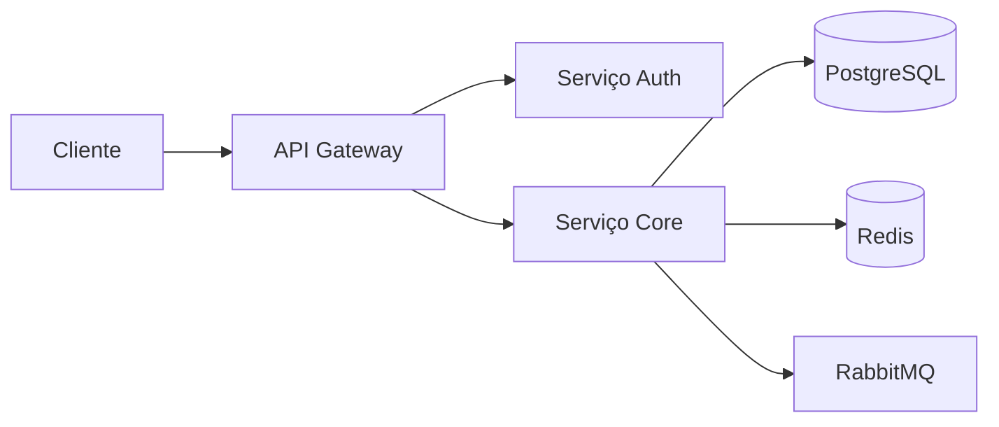

# Deployment pipeline

**Produto:** AIRich AI Assistant | **Departamento:** Produtos | **Data:** 2026-03-26 | **Versão:** 1.7

---

## Visão Geral

Este guia técnico aborda os aspectos fundamentais de Deployment pipeline na AIRich.

No cenário atual de transformação digital, Deployment pipeline desempenha um papel fundamental na capacidade da AIRich de entregar valor aos seus clientes. Este documento estabelece as diretrizes para garantir consistência e eficiência.

## Arquitetura

## Procedimento

Para executar este processo corretamente:

1. Verificar pré-requisitos e dependências
2. Aplicar o procedimento conforme documentação técnica
3. Validar resultados com a equipe responsável
4. Atualizar a documentação com eventuais mudanças
5. Comunicar stakeholders sobre o status

## Infraestrutura

| Componente | Tecnologia | Versão | Propósito |
|------------|------------|--------|----------|
| Backend | Python | 3.12 | Lógica de negócio |
| Banco de Dados | PostgreSQL | 16 | Persistência |
| Cache | Redis | 7.x | Performance |
| Mensageria | RabbitMQ | 3.13 | Comunicação async |
| Container | Docker | 25.x | Isolamento |
| Orquestração | Kubernetes | 1.29 | Escalabilidade |

## Troubleshooting

### Problema: Falha na execução

**Sintoma:** O processo apresenta erro inesperado durante a execução.

**Causas possíveis:**
- Configuração incorreta do ambiente
- Dependência externa indisponível
- Limite de recursos atingido

**Solução:**
1. Verificar logs do sistema
2. Confirmar conectividade com serviços dependentes
3. Reiniciar o serviço se necessário
4. Escalar para o time de SRE se o problema persistir

## Segurança

- **Transporte:** TLS 1.3 obrigatório para todas as comunicações
- **Autenticação:** JWT com rotação automática de chaves
- **Autorização:** RBAC com granularidade por recurso
- **Auditoria:** Log imutável de todas as operações sensíveis
- **Criptografia:** AES-256 para dados sensíveis em repouso

---

*Documento mantido pela equipe de Produtos — AIRich Tecnologia*
