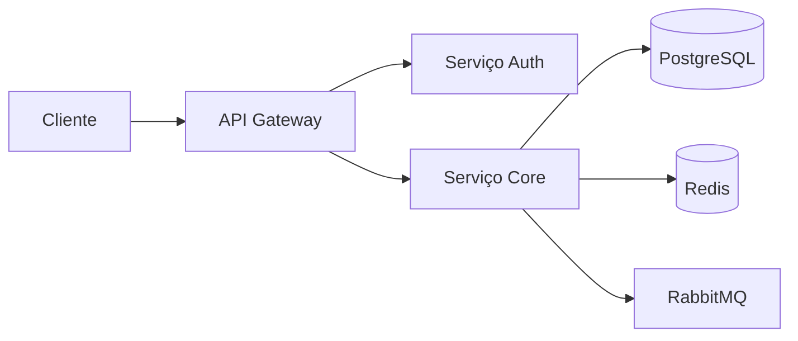

# Embedding models

**Produto:** AIRich AI Assistant | **Departamento:** Produtos | **Data:** 2026-08-08 | **Versão:** 1.7

---

## Visão Geral

Este documento fornece uma visão detalhada sobre Embedding models no ecossistema AIRich.

A AIRich Tecnologia mantém um compromisso contínuo com a excelência operacional. Embedding models representa um componente essencial dessa estratégia, garantindo que nossos produtos atendam aos mais altos padrões de qualidade e confiabilidade.

## Arquitetura

## Procedimento

As etapas recomendadas são:

| Etapa | Responsável | Prazo |
|-------|------------|-------|
| Análise | Equipe Técnica | 2 dias |
| Implementação | Desenvolvedor | 5 dias |
| Testes | QA | 3 dias |
| Aprovação | Tech Lead | 1 dia |

## Infraestrutura

| Ambiente | URL | Status | Responsável |
|---------|-----|--------|-----------|
| Produção | app.airich.com | Ativo | SRE |
| Staging | staging.airich.com | Ativo | DevOps |
| Dev | dev.airich.com | Ativo | Engenharia |
| QA | qa.airich.com | Ativo | QA Lead |

## Troubleshooting

### Problema: Falha na execução

**Sintoma:** O processo apresenta erro inesperado durante a execução.

**Causas possíveis:**
- Configuração incorreta do ambiente
- Dependência externa indisponível
- Limite de recursos atingido

**Solução:**
1. Verificar logs do sistema
2. Confirmar conectividade com serviços dependentes
3. Reiniciar o serviço se necessário
4. Escalar para o time de SRE se o problema persistir

## Segurança

- **Transporte:** TLS 1.3 obrigatório para todas as comunicações
- **Autenticação:** JWT com rotação automática de chaves
- **Autorização:** RBAC com granularidade por recurso
- **Auditoria:** Log imutável de todas as operações sensíveis
- **Criptografia:** AES-256 para dados sensíveis em repouso

---

*Documento mantido pela equipe de Produtos — AIRich Tecnologia*
