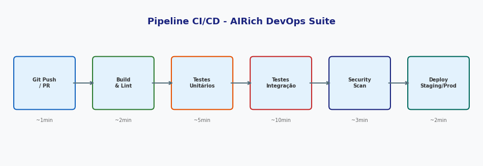
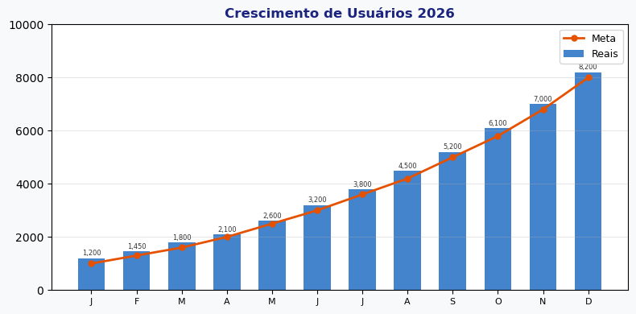

# LLM integration

**Produto:** AIRich AI Assistant | **Departamento:** Produtos | **Data:** 2026-09-15

---

## Visão Geral

O presente documento tem como objetivo apresentar LLM integration para as equipes envolvidas.

Como parte da estratégia de inovação da AIRich, LLM integration foi projetado para suportar o crescimento escalável da plataforma, garantindo robustez e flexibilidade.

## Procedimento

O procedimento padrão para esta atividade segue as seguintes etapas:

1. **Identificação** — Reconhecer o escopo e os requisitos necessários
2. **Planejamento** — Definir recursos, cronograma e responsabilidades
3. **Execução** — Implementar conforme as especificações técnicas
4. **Validação** — Verificar se os resultados atendem aos critérios de aceite
5. **Documentação** — Registrar todas as ações e decisões tomadas

## Infraestrutura

| Ambiente | URL | Status | Responsável |
|---------|-----|--------|-----------|
| Produção | app.airich.com | Ativo | SRE |
| Staging | staging.airich.com | Ativo | DevOps |
| Dev | dev.airich.com | Ativo | Engenharia |
| QA | qa.airich.com | Ativo | QA Lead |

---

*Documento mantido pela equipe de Produtos — AIRich Tecnologia*
