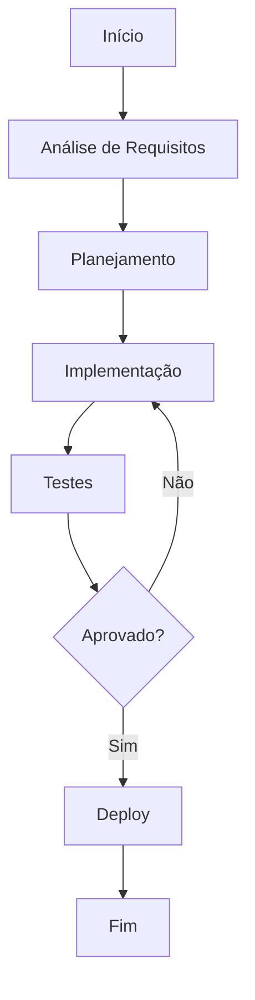

# Changelog v1.5

**Produto:** AIRich Analytics | **Departamento:** Produtos | **Data:** 2026-04-21 | **Versão:** 1.8

---

## Visão Geral

O objetivo deste material é documentar as práticas recomendadas para Changelog v1.5.

A AIRich Tecnologia mantém um compromisso contínuo com a excelência operacional. Changelog v1.5 representa um componente essencial dessa estratégia, garantindo que nossos produtos atendam aos mais altos padrões de qualidade e confiabilidade.

## Arquitetura

## Procedimento

Para executar este processo corretamente:

1. Verificar pré-requisitos e dependências
2. Aplicar o procedimento conforme documentação técnica
3. Validar resultados com a equipe responsável
4. Atualizar a documentação com eventuais mudanças
5. Comunicar stakeholders sobre o status

## Infraestrutura

| Ambiente | URL | Status | Responsável |
|---------|-----|--------|-----------|
| Produção | app.airich.com | Ativo | SRE |
| Staging | staging.airich.com | Ativo | DevOps |
| Dev | dev.airich.com | Ativo | Engenharia |
| QA | qa.airich.com | Ativo | QA Lead |

## Troubleshooting

### Problema: Falha na execução

**Sintoma:** O processo apresenta erro inesperado durante a execução.

**Causas possíveis:**
- Configuração incorreta do ambiente
- Dependência externa indisponível
- Limite de recursos atingido

**Solução:**
1. Verificar logs do sistema
2. Confirmar conectividade com serviços dependentes
3. Reiniciar o serviço se necessário
4. Escalar para o time de SRE se o problema persistir

## Segurança

- **Transporte:** TLS 1.3 obrigatório para todas as comunicações
- **Autenticação:** JWT com rotação automática de chaves
- **Autorização:** RBAC com granularidade por recurso
- **Auditoria:** Log imutável de todas as operações sensíveis
- **Criptografia:** AES-256 para dados sensíveis em repouso

---

*Documento mantido pela equipe de Produtos — AIRich Tecnologia*
