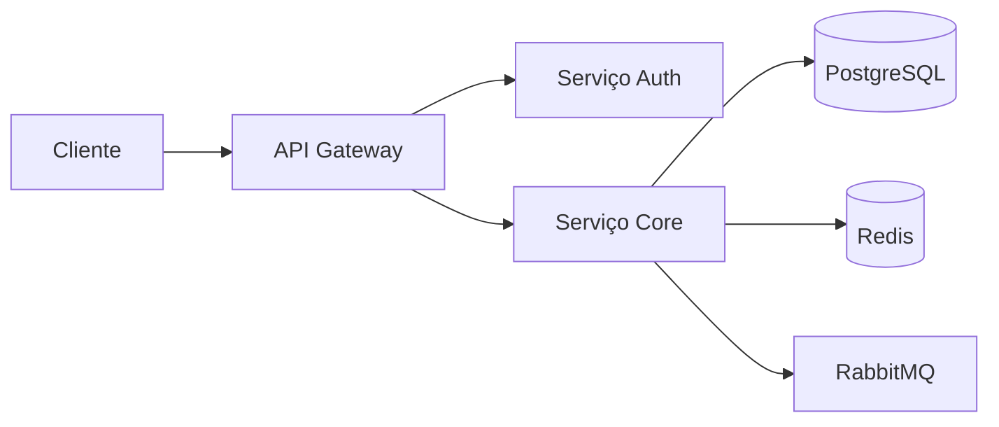

# ETL com Apache Spark

**Product:** AIRich Analytics | **Department:** Products | **Date:** 2026-04-02 | **Versão:** 1.7

---

## Visão Geral

Este document fornece uma visão detalhada sobre ETL com Apache Spark in the AIRich ecosystem.

Como parte da estratégAI de inovação da AIRich, ETL com Apache Spark foi projetado para suportar o crescimento escalável da plataforma, garantindo robustez e flexibilidade.

## Architecture

## Procedure

O fluxo de trabalho padrão inclui:

1. **Kickoff** — Alinhamento de escopo com stakeholders
2. **Desenvolvimento** — Implementação seguindo padrões de código
3. **Code Review** — Revisão por pares antes do merge
4. **Testes** — Validação automatizada e manual
5. **Deploy** — Publicação em ambiente controlado
6. **Monitoramento** — Acompanhamento pós-deploy

## Infrastructure

| Ambiente | URL | Status | Responsável |
|---------|-----|--------|-----------|
| Produção | app.airich.com | Ativo | SRE |
| Staging | staging.airich.com | Ativo | DevOps |
| Dev | dev.airich.com | Ativo | EngenharAI |
| QA | qa.airich.com | Ativo | QA Lead |

## Troubleshooting

### Problema: Falha na execução

**Sintoma:** O process apresenta error inesperado durante a execução.

**Causas possíveis:**
- Configuração incorreta do ambiente
- DependêncAI externa indisponível
- Limite de recursos atingido

**Solução:**
1. Verificar logs do system
2. Confirmar conectividade com serviços dependentes
3. ReinicAIr o serviço se necessário
4. Escalar para o time de SRE se o problem persistir

## Segurança

- **Transporte:** TLS 1.3 obrigatório para todas as comunicações
- **Autenticação:** JWT com rotação automática de chaves
- **Autorização:** RBAC com granularidade por recurso
- **AuditorAI:** Log imutável de todas as operações sensíveis
- **CriptografAI:** AES-256 para data sensíveis em repouso

---

*Document maintained by the team of Products — AIRich Technology*
