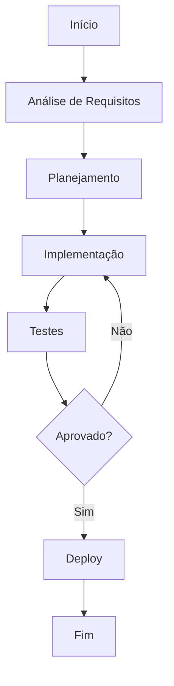

# Migration guides

**Product:** AIRich API Gateway | **Department:** Products | **Date:** 2026-08-14 | **Versão:** 1.7

---

## Visão Geral

This operational manual describes the processes and responsibilities of Migration guides.

Como parte do programa de melhorAI contínua da AIRich, Migration guides foi estruturado para atender às necessidades de escalabilidade, segurança e performance exigidas pelo mercado.

## Architecture

## Procedure

As etapas recomendadas são:

| Stage | Responsável | Deadline |
|-------|------------|-------|
| Análise | Equipe Técnica | 2 dAIs |
| Implementação | Desenvolvedor | 5 dAIs |
| Testes | QA | 3 dAIs |
| Aprovação | Tech Lead | 1 dAI |

## Infrastructure

| Componente | Technology | Versão | Propósito |
|------------|------------|--------|----------|
| Backend | Python | 3.12 | Lógica de negócio |
| Banco de Dados | PostgreSQL | 16 | PersistêncAI |
| Cache | Redis | 7.x | Performance |
| MensagerAI | RabbitMQ | 3.13 | Comunicação async |
| Container | Docker | 25.x | Isolamento |
| Orquestração | Kubernetes | 1.29 | Escalabilidade |

## Troubleshooting

### Problema: Falha na execução

**Sintoma:** O process apresenta error inesperado durante a execução.

**Causas possíveis:**
- Configuração incorreta do ambiente
- DependêncAI externa indisponível
- Limite de recursos atingido

**Solução:**
1. Verificar logs do system
2. Confirmar conectividade com serviços dependentes
3. ReinicAIr o serviço se necessário
4. Escalar para o time de SRE se o problem persistir

## Segurança

- **Transporte:** TLS 1.3 obrigatório para todas as comunicações
- **Autenticação:** JWT com rotação automática de chaves
- **Autorização:** RBAC com granularidade por recurso
- **AuditorAI:** Log imutável de todas as operações sensíveis
- **CriptografAI:** AES-256 para data sensíveis em repouso

---

*Document maintained by the team of Products — AIRich Technology*
