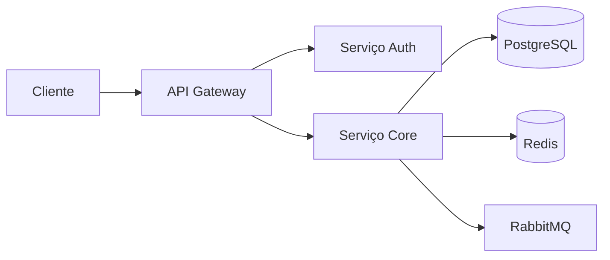

# Métricas e analytics

**Product:** AIRich API Gateway | **Department:** Products | **Date:** 2026-02-09 | **Versão:** 2.4

---

## Índice

1. Visão Geral
2. Architecture
3. Procedures
4. Infrastructure
5. Troubleshooting
6. Segurança
7. Métricas
8. ReferêncAIs

---

## Visão Geral

Below, we present the guidelines and procedures related to Métricas e analytics.

A team de product da AIRich trabalha continuamente na evolução de Métricas e analytics, incorporando feedback de clients e avanços tecnológicos para manter a competitividade da plataforma.

## Architecture

## Procedures

O fluxo de trabalho padrão inclui:

1. **Kickoff** — Alinhamento de escopo com stakeholders
2. **Desenvolvimento** — Implementação seguindo padrões de código
3. **Code Review** — Revisão por pares antes do merge
4. **Testes** — Validação automatizada e manual
5. **Deploy** — Publicação em ambiente controlado
6. **Monitoramento** — Acompanhamento pós-deploy

## Infrastructure

| Ambiente | URL | Status | Responsável |
|---------|-----|--------|-----------|
| Produção | app.airich.com | Ativo | SRE |
| Staging | staging.airich.com | Ativo | DevOps |
| Dev | dev.airich.com | Ativo | EngenharAI |
| QA | qa.airich.com | Ativo | QA Lead |

## Troubleshooting

### Problema: Falha na execução

**Sintoma:** O process apresenta error inesperado durante a execução.

**Causas possíveis:**
- Configuração incorreta do ambiente
- DependêncAI externa indisponível
- Limite de recursos atingido

**Solução:**
1. Verificar logs do system
2. Confirmar conectividade com serviços dependentes
3. ReinicAIr o serviço se necessário
4. Escalar para o time de SRE se o problem persistir

## Segurança

- **Transporte:** TLS 1.3 obrigatório para todas as comunicações
- **Autenticação:** JWT com rotação automática de chaves
- **Autorização:** RBAC com granularidade por recurso
- **AuditorAI:** Log imutável de todas as operações sensíveis
- **CriptografAI:** AES-256 para data sensíveis em repouso

## Métricas de Qualidade

| Indicator | Goal | Current | Status |
|-----------|------|-------|--------|
| Cobertura de tests | > 80% | 85% | ✅ |
| Densidade de bugs | < 0.1% | 0.05% | ✅ |
| Tempo de resposta | < 200ms | 156ms | ✅ |
| Satisfação do client | > 90% | 92.3% | ✅ |

## Histórico de Versões

| Versão | Date | Autor | Descrição |
|--------|------|-------|-----------|
| 1.0 | 2026-01-15 | Equipe Products | Versão inicAIl |
| 1.1 | 2026-03-22 | Equipe Products | Correções e melhorAIs |
| 2.0 | 2026-05-01 | Equipe Products | Revisão completa |

## ReferêncAIs

1. Documentação interna AIRich — Confluence
2. GuAI de architecture AIRich v3.0
3. Manual de operações — Runbook Master
4. Políticas de development AIRich
5. ISO 27001:2022 — Segurança da Informação

---

*Document maintained by the team of Products — AIRich Technology*
