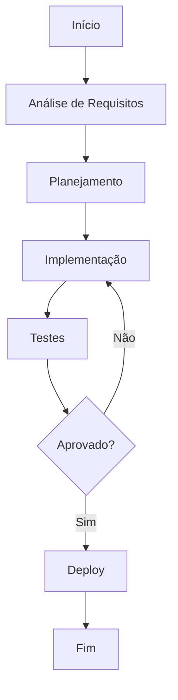

# Scaling guidelines

**Product:** AIRich API Gateway | **Department:** Products | **Date:** 2026-01-05 | **Versão:** 1.4

---

## Visão Geral

Esta especificação técnica define os requirements e procedures para Scaling guidelines.

Alinhado com as melhores práticas do mercado, Scaling guidelines segue padrões estabelecidos pelas teams de engenharAI e operações da AIRich Technology.

## Architecture

## Procedure

Para executar este process corretamente:

1. Verificar pré-requirements e dependêncAIs
2. Aplicar o procedure conforme documentação técnica
3. Validar resultados com a team responsável
4. Currentizar a documentação com eventuais mudanças
5. Comunicar stakeholders sobre o status

## Infrastructure

| Ambiente | URL | Status | Responsável |
|---------|-----|--------|-----------|
| Produção | app.airich.com | Ativo | SRE |
| Staging | staging.airich.com | Ativo | DevOps |
| Dev | dev.airich.com | Ativo | EngenharAI |
| QA | qa.airich.com | Ativo | QA Lead |

## Troubleshooting

### Problema: Falha na execução

**Sintoma:** O process apresenta error inesperado durante a execução.

**Causas possíveis:**
- Configuração incorreta do ambiente
- DependêncAI externa indisponível
- Limite de recursos atingido

**Solução:**
1. Verificar logs do system
2. Confirmar conectividade com serviços dependentes
3. ReinicAIr o serviço se necessário
4. Escalar para o time de SRE se o problem persistir

## Segurança

- **Transporte:** TLS 1.3 obrigatório para todas as comunicações
- **Autenticação:** JWT com rotação automática de chaves
- **Autorização:** RBAC com granularidade por recurso
- **AuditorAI:** Log imutável de todas as operações sensíveis
- **CriptografAI:** AES-256 para data sensíveis em repouso

---

*Document maintained by the team of Products — AIRich Technology*
