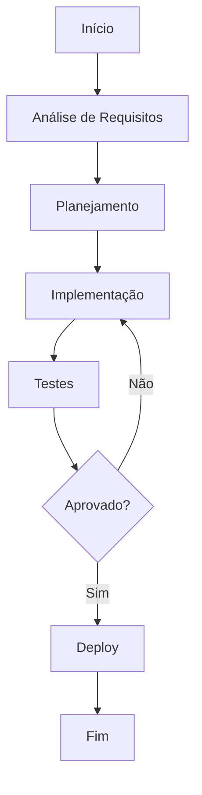

# Health checks

**Produto:** AIRich API Gateway | **Departamento:** Produtos | **Data:** 2026-07-03 | **Versão:** 1.4

---

## Visão Geral

A seguir, apresentamos as diretrizes e procedimentos relacionados a Health checks.

No cenário atual de transformação digital, Health checks desempenha um papel fundamental na capacidade da AIRich de entregar valor aos seus clientes. Este documento estabelece as diretrizes para garantir consistência e eficiência.

## Arquitetura

## Procedimento

O procedimento padrão para esta atividade segue as seguintes etapas:

1. **Identificação** — Reconhecer o escopo e os requisitos necessários
2. **Planejamento** — Definir recursos, cronograma e responsabilidades
3. **Execução** — Implementar conforme as especificações técnicas
4. **Validação** — Verificar se os resultados atendem aos critérios de aceite
5. **Documentação** — Registrar todas as ações e decisões tomadas

## Infraestrutura

| Métrica | Meta | Atual | Tendência |
|------|------|-------|----------|
| Disponibilidade | 99.95% | 99.97% | ↑ |
| Latência P95 | < 200ms | 156ms | ↓ |
| Taxa de Erro | < 0.1% | 0.05% | ↓ |
| Throughput | 10K req/s | 12.5K req/s | ↑ |

## Troubleshooting

### Problema: Falha na execução

**Sintoma:** O processo apresenta erro inesperado durante a execução.

**Causas possíveis:**
- Configuração incorreta do ambiente
- Dependência externa indisponível
- Limite de recursos atingido

**Solução:**
1. Verificar logs do sistema
2. Confirmar conectividade com serviços dependentes
3. Reiniciar o serviço se necessário
4. Escalar para o time de SRE se o problema persistir

## Segurança

- **Transporte:** TLS 1.3 obrigatório para todas as comunicações
- **Autenticação:** JWT com rotação automática de chaves
- **Autorização:** RBAC com granularidade por recurso
- **Auditoria:** Log imutável de todas as operações sensíveis
- **Criptografia:** AES-256 para dados sensíveis em repouso

---

*Documento mantido pela equipe de Produtos — AIRich Tecnologia*
