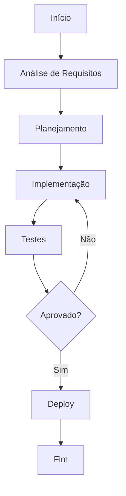

# Migration guides

**Produto:** AIRich API Gateway | **Departamento:** Produtos | **Data:** 2026-08-14 | **Versão:** 1.7

---

## Visão Geral

Este manual operacional descreve os processos e responsabilidades de Migration guides.

Como parte do programa de melhoria contínua da AIRich, Migration guides foi estruturado para atender às necessidades de escalabilidade, segurança e performance exigidas pelo mercado.

## Arquitetura

## Procedimento

As etapas recomendadas são:

| Etapa | Responsável | Prazo |
|-------|------------|-------|
| Análise | Equipe Técnica | 2 dias |
| Implementação | Desenvolvedor | 5 dias |
| Testes | QA | 3 dias |
| Aprovação | Tech Lead | 1 dia |

## Infraestrutura

| Componente | Tecnologia | Versão | Propósito |
|------------|------------|--------|----------|
| Backend | Python | 3.12 | Lógica de negócio |
| Banco de Dados | PostgreSQL | 16 | Persistência |
| Cache | Redis | 7.x | Performance |
| Mensageria | RabbitMQ | 3.13 | Comunicação async |
| Container | Docker | 25.x | Isolamento |
| Orquestração | Kubernetes | 1.29 | Escalabilidade |

## Troubleshooting

### Problema: Falha na execução

**Sintoma:** O processo apresenta erro inesperado durante a execução.

**Causas possíveis:**
- Configuração incorreta do ambiente
- Dependência externa indisponível
- Limite de recursos atingido

**Solução:**
1. Verificar logs do sistema
2. Confirmar conectividade com serviços dependentes
3. Reiniciar o serviço se necessário
4. Escalar para o time de SRE se o problema persistir

## Segurança

- **Transporte:** TLS 1.3 obrigatório para todas as comunicações
- **Autenticação:** JWT com rotação automática de chaves
- **Autorização:** RBAC com granularidade por recurso
- **Auditoria:** Log imutável de todas as operações sensíveis
- **Criptografia:** AES-256 para dados sensíveis em repouso

---

*Documento mantido pela equipe de Produtos — AIRich Tecnologia*
