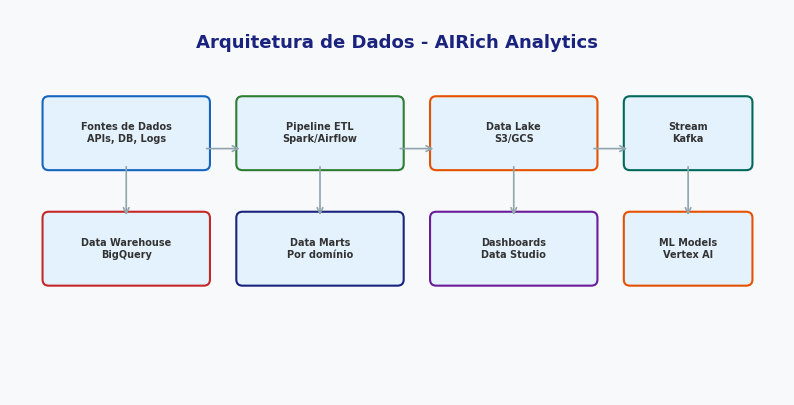

# OAuth2 flow completo

**Produto:** AIRich API Gateway | **Departamento:** Produtos | **Data:** 2026-06-06

---

## Visão Geral

Esta especificação técnica define os requisitos e procedimentos para OAuth2 flow completo.

A evolução constante do ecossistema AIRich demanda processos bem definidos. OAuth2 flow completo foi documentado para orientar as equipes técnicas e operacionais na execução de suas atividades.

## Procedimento

O procedimento padrão para esta atividade segue as seguintes etapas:

1. **Identificação** — Reconhecer o escopo e os requisitos necessários
2. **Planejamento** — Definir recursos, cronograma e responsabilidades
3. **Execução** — Implementar conforme as especificações técnicas
4. **Validação** — Verificar se os resultados atendem aos critérios de aceite
5. **Documentação** — Registrar todas as ações e decisões tomadas

## Infraestrutura

| Componente | Tecnologia | Versão | Propósito |
|------------|------------|--------|----------|
| Backend | Python | 3.12 | Lógica de negócio |
| Banco de Dados | PostgreSQL | 16 | Persistência |
| Cache | Redis | 7.x | Performance |
| Mensageria | RabbitMQ | 3.13 | Comunicação async |
| Container | Docker | 25.x | Isolamento |
| Orquestração | Kubernetes | 1.29 | Escalabilidade |

---

*Documento mantido pela equipe de Produtos — AIRich Tecnologia*
