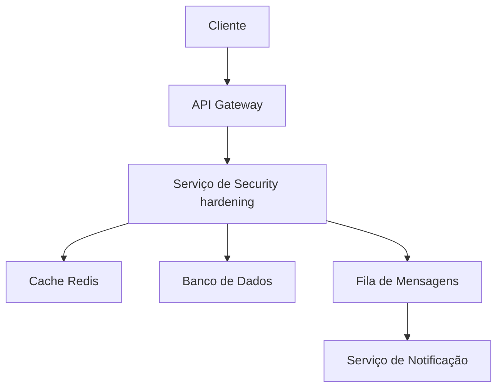

# Security hardening

**Produto:** AIRich API Gateway  
**Departamento:** Produtos  
**Data:** 2026-01-07  
**Versão:** 2.0

---

## Segurança

A segurança do security hardening é tratada em múltiplas camadas:

- **Transporte:** TLS 1.3 obrigatório
- **Autenticação:** JWT com rotação de chaves
- **Autorização:** RBAC com granularidade fina
- **Auditoria:** Log imutável de todas as operações
- **Criptografia:** AES-256 para dados sensíveis em repouso

## Introdução

O security hardening é um dos pilares fundamentais do AIRich API Gateway, parte integrante do ecossistema de produtos da AIRich Tecnologia. Desde sua concepção, este componente foi projetado para atender empresas de diversos portes, desde startups até grandes corporações com operações em múltiplos países.

A AIRich Tecnologia, fundada em 2019, tem como missão democratizar o acesso a ferramentas de tecnologia de ponta para o mercado brasileiro e latino-americano. O AIRich API Gateway é resultado direto dessa visão, combinando inovação tecnológica com profundo entendimento das necessidades do mercado local.

## Métricas e Monitoramento

O security hardening é monitorado 24/7 através de:

- **Latência:** P50 < 50ms, P95 < 200ms, P99 < 500ms
- **Disponibilidade:** SLA de 99.95% mensal
- **Taxa de Erro:** Meta < 0.1% das requisições
- **Throughput:** Suporta até 10.000 req/s por instância

## Fluxo de Operação

O fluxo típico de operação do security hardening segue as seguintes etapas:

1. **Recepção:** A requisição é recebida via API Gateway e validada
2. **Autenticação:** Token JWT é verificado e permissões são checadas
3. **Processamento:** Regras de negócio são aplicadas
4. **Persistência:** Dados são armazenados no banco de dados
5. **Notificação:** Eventos são publicados na fila de mensagens
6. **Resposta:** Resultado é retornado ao cliente

## Visão Geral da Arquitetura

A arquitetura do security hardening segue o padrão de microsserviços, permitindo escalabilidade independente e facilitando a manutenção. O sistema é composto por:

- **Camada de API:** Responsável por receber e validar todas as requisições
- **Camada de Negócio:** Contém as regras de negócio e orquestração de processos
- **Camada de Dados:** Gerencia persistência e cache distribuído
- **Camada de Integração:** Comunicação com serviços externos e mensageria

## Detalhes de Implementação

A implementação do security hardening utiliza tecnologias modernas e consolidadas no mercado:

| Tecnologia | Versão | Propósito |
|-----------|--------|-----------|
| Python | 3.12 | Backend principal |
| PostgreSQL | 16 | Banco de dados relacional |
| Redis | 7.x | Cache e sessões |
| RabbitMQ | 3.13 | Mensageria assíncrona |
| Docker | 25.x | Containerização |
| Kubernetes | 1.29 | Orquestração |

## Introdução

O security hardening é um dos pilares fundamentais do AIRich API Gateway, parte integrante do ecossistema de produtos da AIRich Tecnologia. Desde sua concepção, este componente foi projetado para atender empresas de diversos portes, desde startups até grandes corporações com operações em múltiplos países.

A AIRich Tecnologia, fundada em 2019, tem como missão democratizar o acesso a ferramentas de tecnologia de ponta para o mercado brasileiro e latino-americano. O AIRich API Gateway é resultado direto dessa visão, combinando inovação tecnológica com profundo entendimento das necessidades do mercado local.

## Troubleshooting

### Problema: Timeout na requisição

**Sintoma:** Requisições retornam erro 504 após 30 segundos.

**Causas possíveis:**
- Sobrecarga no banco de dados
- Cache expirado causando consultas pesadas
- Conexão de rede instável

**Solução:**
1. Verificar métricas do banco de dados
2. Limpar cache e forçar reindexação
3. Verificar conectividade de rede
4. Escalar horizontalmente se necessário

## Visão Geral da Arquitetura

A arquitetura do security hardening segue o padrão de microsserviços, permitindo escalabilidade independente e facilitando a manutenção. O sistema é composto por:

- **Camada de API:** Responsável por receber e validar todas as requisições
- **Camada de Negócio:** Contém as regras de negócio e orquestração de processos
- **Camada de Dados:** Gerencia persistência e cache distribuído
- **Camada de Integração:** Comunicação com serviços externos e mensageria

