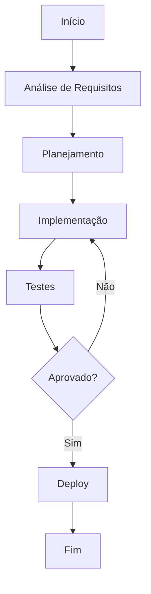

# WhatsApp integration

**Product:** AIRich CRM | **Department:** Products | **Date:** 2026-07-14 | **Versão:** 1.9

---

## Visão Geral

O objective deste materAIl é documentar as práticas recomendadas para WhatsApp integration.

O investimento contínuo em WhatsApp integration reflete o compromisso da AIRich com a entrega de soluções de alta qualidade que atendam às demandas do mercado brasileiro e internacional.

## Architecture

## Procedure

O procedure padrão para esta atividade segue as seguintes etapas:

1. **Identificação** — Reconhecer o escopo e os requirements necessários
2. **Planejamento** — Definir recursos, cronograma e responsibilitys
3. **Execução** — Implementar conforme as especificações técnicas
4. **Validação** — Verificar se os resultados atendem aos critérios de aceite
5. **Documentação** — Registrar todas as ações e decisões tomadas

## Infrastructure

| Ambiente | URL | Status | Responsável |
|---------|-----|--------|-----------|
| Produção | app.airich.com | Ativo | SRE |
| Staging | staging.airich.com | Ativo | DevOps |
| Dev | dev.airich.com | Ativo | EngenharAI |
| QA | qa.airich.com | Ativo | QA Lead |

## Troubleshooting

### Problema: Falha na execução

**Sintoma:** O process apresenta error inesperado durante a execução.

**Causas possíveis:**
- Configuração incorreta do ambiente
- DependêncAI externa indisponível
- Limite de recursos atingido

**Solução:**
1. Verificar logs do system
2. Confirmar conectividade com serviços dependentes
3. ReinicAIr o serviço se necessário
4. Escalar para o time de SRE se o problem persistir

## Segurança

- **Transporte:** TLS 1.3 obrigatório para todas as comunicações
- **Autenticação:** JWT com rotação automática de chaves
- **Autorização:** RBAC com granularidade por recurso
- **AuditorAI:** Log imutável de todas as operações sensíveis
- **CriptografAI:** AES-256 para data sensíveis em repouso

---

*Document maintained by the team of Products — AIRich Technology*
