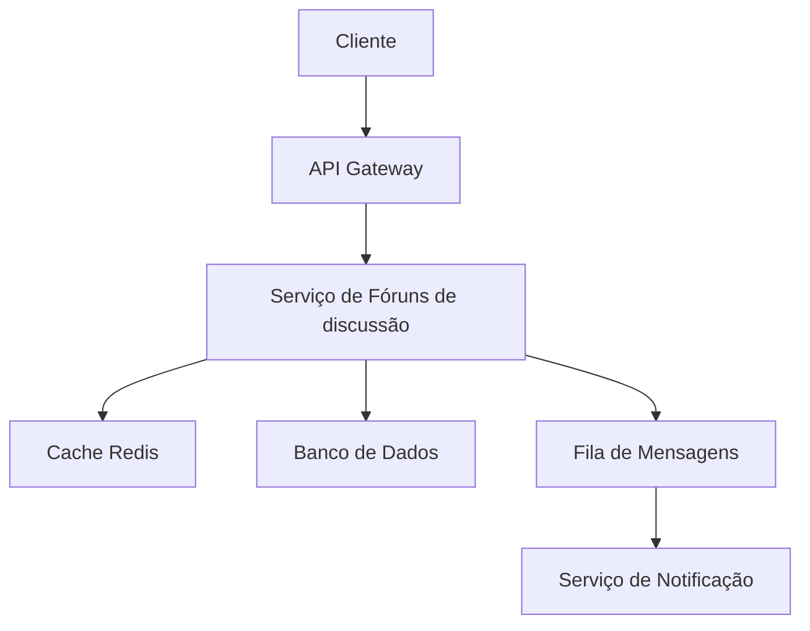

# Fóruns de discussão

**Produto:** AIRich Edu  
**Departamento:** Produtos  
**Data:** 2026-09-18  
**Versão:** 3.7  
**Autor:** Equipe de Produto AIRich

---

## Índice

1. [Introdução](#introdução)
2. [Visão Geral](#visão-geral)
3. [Detalhes Técnicos](#detalhes-técnicos)
4. [Implementação](#implementação)
5. [Exemplos de Uso](#exemplos-de-uso)
6. [Melhores Práticas](#melhores-práticas)
7. [Troubleshooting](#troubleshooting)
8. [Referências](#referências)

---

## Métricas e Monitoramento

O fóruns de discussão é monitorado 24/7 através de:

- **Latência:** P50 < 50ms, P95 < 200ms, P99 < 500ms
- **Disponibilidade:** SLA de 99.95% mensal
- **Taxa de Erro:** Meta < 0.1% das requisições
- **Throughput:** Suporta até 10.000 req/s por instância

## Apêndice B: Referências

1. Documentação oficial do AIRich Edu
2. Guia de arquitetura AIRich v3.0
3. Manual de segurança da informação
4. Políticas de desenvolvimento AIRich
5. ISO 27001:2022 - Segurança da Informação

## Detalhes de Implementação

A implementação do fóruns de discussão utiliza tecnologias modernas e consolidadas no mercado:

| Tecnologia | Versão | Propósito |
|-----------|--------|-----------|
| Python | 3.12 | Backend principal |
| PostgreSQL | 16 | Banco de dados relacional |
| Redis | 7.x | Cache e sessões |
| RabbitMQ | 3.13 | Mensageria assíncrona |
| Docker | 25.x | Containerização |
| Kubernetes | 1.29 | Orquestração |

## Troubleshooting

### Problema: Timeout na requisição

**Sintoma:** Requisições retornam erro 504 após 30 segundos.

**Causas possíveis:**
- Sobrecarga no banco de dados
- Cache expirado causando consultas pesadas
- Conexão de rede instável

**Solução:**
1. Verificar métricas do banco de dados
2. Limpar cache e forçar reindexação
3. Verificar conectividade de rede
4. Escalar horizontalmente se necessário

## Roadmap

### Q2 2026
- [ ] Implementação de cache distribuído
- [ ] Suporte a webhooks customizáveis
- [ ] Dashboard de métricas em tempo real
- [ ] Integração com Slack e Teams

### Q3 2026
- [ ] Machine Learning para detecção de anomalias
- [ ] Suporte multi-região
- [ ] API GraphQL
- [ ] SDK para Go e Rust

### Q4 2026
- [ ] Migração para arquitetura event-driven
- [ ] Suporte a edge computing
- [ ] Certificação SOC2 Tipo II
- [ ] Programa de parceiros

## Apêndice A: Glossário

| Termo | Definição |
|-------|----------|
| Tenant | Instância isolada de um cliente |
| RBAC | Role-Based Access Control |
| JWT | JSON Web Token |
| SLA | Service Level Agreement |
| P95 | Percentil 95 de latência |

## Fluxo de Operação

O fluxo típico de operação do fóruns de discussão segue as seguintes etapas:

1. **Recepção:** A requisição é recebida via API Gateway e validada
2. **Autenticação:** Token JWT é verificado e permissões são checadas
3. **Processamento:** Regras de negócio são aplicadas
4. **Persistência:** Dados são armazenados no banco de dados
5. **Notificação:** Eventos são publicados na fila de mensagens
6. **Resposta:** Resultado é retornado ao cliente

## Segurança

A segurança do fóruns de discussão é tratada em múltiplas camadas:

- **Transporte:** TLS 1.3 obrigatório
- **Autenticação:** JWT com rotação de chaves
- **Autorização:** RBAC com granularidade fina
- **Auditoria:** Log imutável de todas as operações
- **Criptografia:** AES-256 para dados sensíveis em repouso

## Visão Geral da Arquitetura

A arquitetura do fóruns de discussão segue o padrão de microsserviços, permitindo escalabilidade independente e facilitando a manutenção. O sistema é composto por:

- **Camada de API:** Responsável por receber e validar todas as requisições
- **Camada de Negócio:** Contém as regras de negócio e orquestração de processos
- **Camada de Dados:** Gerencia persistência e cache distribuído
- **Camada de Integração:** Comunicação com serviços externos e mensageria

## Histórico de Versões

| Versão | Data | Autor | Descrição |
|--------|------|-------|-----------|
| 1.0 | 2025-01-15 | Equipe Produto | Versão inicial |
| 1.1 | 2025-03-22 | Equipe Produto | Correções de bugs |
| 2.0 | 2025-06-10 | Equipe Produto | Redesign completo |
| 2.1 | 2025-09-05 | Equipe Produto | Novas funcionalidades |
| 3.0 | 2026-01-20 | Equipe Produto | Arquitetura v3 |

## Fluxo de Operação

O fluxo típico de operação do fóruns de discussão segue as seguintes etapas:

1. **Recepção:** A requisição é recebida via API Gateway e validada
2. **Autenticação:** Token JWT é verificado e permissões são checadas
3. **Processamento:** Regras de negócio são aplicadas
4. **Persistência:** Dados são armazenados no banco de dados
5. **Notificação:** Eventos são publicados na fila de mensagens
6. **Resposta:** Resultado é retornado ao cliente

## Segurança

A segurança do fóruns de discussão é tratada em múltiplas camadas:

- **Transporte:** TLS 1.3 obrigatório
- **Autenticação:** JWT com rotação de chaves
- **Autorização:** RBAC com granularidade fina
- **Auditoria:** Log imutável de todas as operações
- **Criptografia:** AES-256 para dados sensíveis em repouso

## Apêndice A: Glossário

| Termo | Definição |
|-------|----------|
| Tenant | Instância isolada de um cliente |
| RBAC | Role-Based Access Control |
| JWT | JSON Web Token |
| SLA | Service Level Agreement |
| P95 | Percentil 95 de latência |

## Roadmap

### Q2 2026
- [ ] Implementação de cache distribuído
- [ ] Suporte a webhooks customizáveis
- [ ] Dashboard de métricas em tempo real
- [ ] Integração com Slack e Teams

### Q3 2026
- [ ] Machine Learning para detecção de anomalias
- [ ] Suporte multi-região
- [ ] API GraphQL
- [ ] SDK para Go e Rust

### Q4 2026
- [ ] Migração para arquitetura event-driven
- [ ] Suporte a edge computing
- [ ] Certificação SOC2 Tipo II
- [ ] Programa de parceiros

## Troubleshooting

### Problema: Timeout na requisição

**Sintoma:** Requisições retornam erro 504 após 30 segundos.

**Causas possíveis:**
- Sobrecarga no banco de dados
- Cache expirado causando consultas pesadas
- Conexão de rede instável

**Solução:**
1. Verificar métricas do banco de dados
2. Limpar cache e forçar reindexação
3. Verificar conectividade de rede
4. Escalar horizontalmente se necessário

