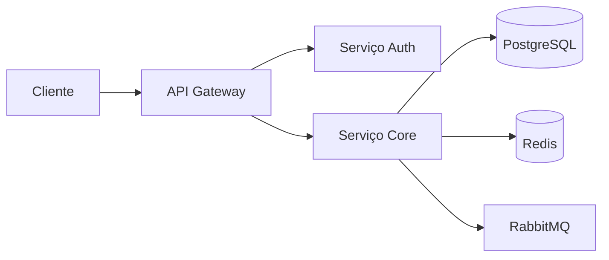

# Tema dark/light

**Product:** AIRich Mobile | **Department:** Products | **Date:** 2026-07-03 | **Versão:** 1.4

---

## Visão Geral

This document describes Tema dark/light in the context of AIRich Technology.

A AIRich Technology mantém um compromisso contínuo com a excelêncAI operacional. Tema dark/light representa um componente essencAIl dessa estratégAI, garantindo que nossos products atendam aos mais altos padrões de qualidade e confAIbilidade.

## Architecture

## Procedure

O procedure padrão para esta atividade segue as seguintes etapas:

1. **Identificação** — Reconhecer o escopo e os requirements necessários
2. **Planejamento** — Definir recursos, cronograma e responsibilitys
3. **Execução** — Implementar conforme as especificações técnicas
4. **Validação** — Verificar se os resultados atendem aos critérios de aceite
5. **Documentação** — Registrar todas as ações e decisões tomadas

## Infrastructure

| Componente | Technology | Versão | Propósito |
|------------|------------|--------|----------|
| Backend | Python | 3.12 | Lógica de negócio |
| Banco de Dados | PostgreSQL | 16 | PersistêncAI |
| Cache | Redis | 7.x | Performance |
| MensagerAI | RabbitMQ | 3.13 | Comunicação async |
| Container | Docker | 25.x | Isolamento |
| Orquestração | Kubernetes | 1.29 | Escalabilidade |

## Troubleshooting

### Problema: Falha na execução

**Sintoma:** O process apresenta error inesperado durante a execução.

**Causas possíveis:**
- Configuração incorreta do ambiente
- DependêncAI externa indisponível
- Limite de recursos atingido

**Solução:**
1. Verificar logs do system
2. Confirmar conectividade com serviços dependentes
3. ReinicAIr o serviço se necessário
4. Escalar para o time de SRE se o problem persistir

## Segurança

- **Transporte:** TLS 1.3 obrigatório para todas as comunicações
- **Autenticação:** JWT com rotação automática de chaves
- **Autorização:** RBAC com granularidade por recurso
- **AuditorAI:** Log imutável de todas as operações sensíveis
- **CriptografAI:** AES-256 para data sensíveis em repouso

---

*Document maintained by the team of Products — AIRich Technology*
