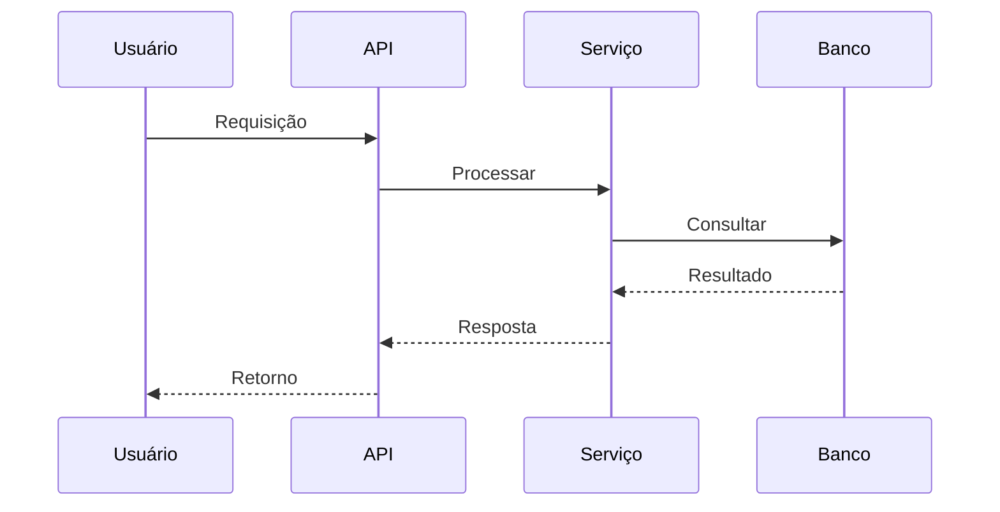

# Fraud detection ML

**Produto:** AIRich Pay | **Departamento:** Produtos | **Data:** 2026-07-23 | **Versão:** 2.8

---

## Índice

1. Visão Geral
2. Arquitetura
3. Procedimentos
4. Infraestrutura
5. Troubleshooting
6. Segurança
7. Métricas
8. Referências

---

## Visão Geral

Este documento fornece uma visão detalhada sobre Fraud detection ML no ecossistema AIRich.

No cenário atual de transformação digital, Fraud detection ML desempenha um papel fundamental na capacidade da AIRich de entregar valor aos seus clientes. Este documento estabelece as diretrizes para garantir consistência e eficiência.

## Arquitetura

## Procedimentos

O fluxo de trabalho padrão inclui:

1. **Kickoff** — Alinhamento de escopo com stakeholders
2. **Desenvolvimento** — Implementação seguindo padrões de código
3. **Code Review** — Revisão por pares antes do merge
4. **Testes** — Validação automatizada e manual
5. **Deploy** — Publicação em ambiente controlado
6. **Monitoramento** — Acompanhamento pós-deploy

## Infraestrutura

| Métrica | Meta | Atual | Tendência |
|------|------|-------|----------|
| Disponibilidade | 99.95% | 99.97% | ↑ |
| Latência P95 | < 200ms | 156ms | ↓ |
| Taxa de Erro | < 0.1% | 0.05% | ↓ |
| Throughput | 10K req/s | 12.5K req/s | ↑ |

## Troubleshooting

### Problema: Falha na execução

**Sintoma:** O processo apresenta erro inesperado durante a execução.

**Causas possíveis:**
- Configuração incorreta do ambiente
- Dependência externa indisponível
- Limite de recursos atingido

**Solução:**
1. Verificar logs do sistema
2. Confirmar conectividade com serviços dependentes
3. Reiniciar o serviço se necessário
4. Escalar para o time de SRE se o problema persistir

## Segurança

- **Transporte:** TLS 1.3 obrigatório para todas as comunicações
- **Autenticação:** JWT com rotação automática de chaves
- **Autorização:** RBAC com granularidade por recurso
- **Auditoria:** Log imutável de todas as operações sensíveis
- **Criptografia:** AES-256 para dados sensíveis em repouso

## Métricas de Qualidade

| Indicador | Meta | Atual | Status |
|-----------|------|-------|--------|
| Cobertura de testes | > 80% | 85% | ✅ |
| Densidade de bugs | < 0.1% | 0.05% | ✅ |
| Tempo de resposta | < 200ms | 156ms | ✅ |
| Satisfação do cliente | > 90% | 92.3% | ✅ |

## Histórico de Versões

| Versão | Data | Autor | Descrição |
|--------|------|-------|-----------|
| 1.0 | 2026-01-15 | Equipe Produtos | Versão inicial |
| 1.1 | 2026-03-22 | Equipe Produtos | Correções e melhorias |
| 2.0 | 2026-05-01 | Equipe Produtos | Revisão completa |

## Referências

1. Documentação interna AIRich — Confluence
2. Guia de arquitetura AIRich v3.0
3. Manual de operações — Runbook Master
4. Políticas de desenvolvimento AIRich
5. ISO 27001:2022 — Segurança da Informação

---

*Documento mantido pela equipe de Produtos — AIRich Tecnologia*
