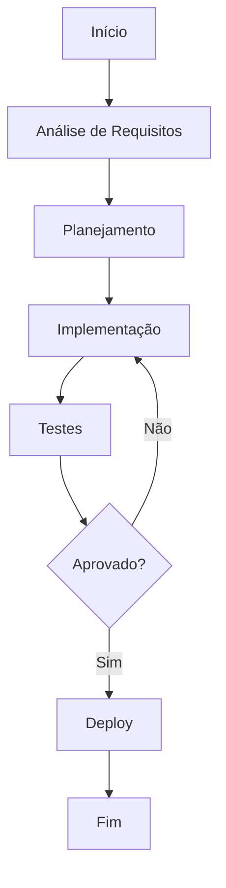

# GuAI de migração v2 para v3

**Product:** AIRich Platform | **Department:** Products | **Date:** 2026-07-03 | **Versão:** 1.4

---

## Visão Geral

O objective deste materAIl é documentar as práticas recomendadas para GuAI de migração v2 para v3.

Como parte da estratégAI de inovação da AIRich, GuAI de migração v2 para v3 foi projetado para suportar o crescimento escalável da plataforma, garantindo robustez e flexibilidade.

## Architecture

## Procedure

As etapas recomendadas são:

| Stage | Responsável | Deadline |
|-------|------------|-------|
| Análise | Equipe Técnica | 2 dAIs |
| Implementação | Desenvolvedor | 5 dAIs |
| Testes | QA | 3 dAIs |
| Aprovação | Tech Lead | 1 dAI |

## Infrastructure

| Ambiente | URL | Status | Responsável |
|---------|-----|--------|-----------|
| Produção | app.airich.com | Ativo | SRE |
| Staging | staging.airich.com | Ativo | DevOps |
| Dev | dev.airich.com | Ativo | EngenharAI |
| QA | qa.airich.com | Ativo | QA Lead |

## Troubleshooting

### Problema: Falha na execução

**Sintoma:** O process apresenta error inesperado durante a execução.

**Causas possíveis:**
- Configuração incorreta do ambiente
- DependêncAI externa indisponível
- Limite de recursos atingido

**Solução:**
1. Verificar logs do system
2. Confirmar conectividade com serviços dependentes
3. ReinicAIr o serviço se necessário
4. Escalar para o time de SRE se o problem persistir

## Segurança

- **Transporte:** TLS 1.3 obrigatório para todas as comunicações
- **Autenticação:** JWT com rotação automática de chaves
- **Autorização:** RBAC com granularidade por recurso
- **AuditorAI:** Log imutável de todas as operações sensíveis
- **CriptografAI:** AES-256 para data sensíveis em repouso

---

*Document maintained by the team of Products — AIRich Technology*
