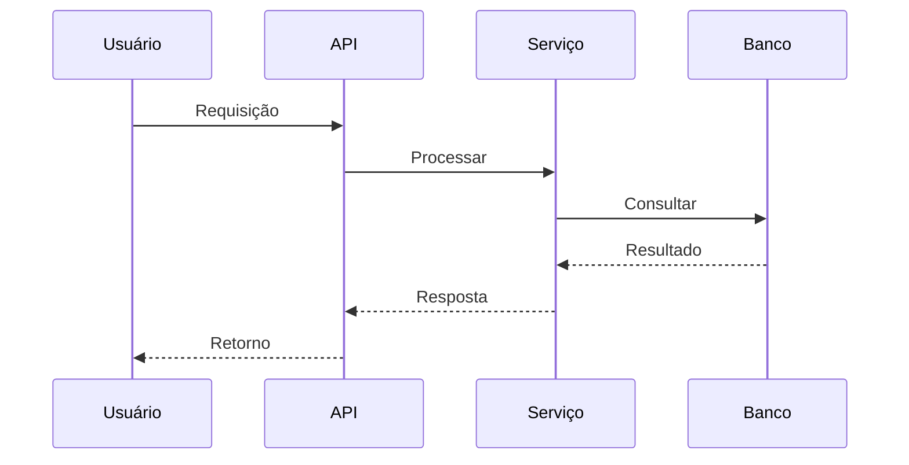

# Sistema de cache

**Produto:** AIRich Platform | **Departamento:** Produtos | **Data:** 2026-06-03 | **Versão:** 1.6

---

## Visão Geral

O objetivo deste material é documentar as práticas recomendadas para Sistema de cache.

No cenário atual de transformação digital, Sistema de cache desempenha um papel fundamental na capacidade da AIRich de entregar valor aos seus clientes. Este documento estabelece as diretrizes para garantir consistência e eficiência.

## Arquitetura

## Procedimento

O fluxo de trabalho padrão inclui:

1. **Kickoff** — Alinhamento de escopo com stakeholders
2. **Desenvolvimento** — Implementação seguindo padrões de código
3. **Code Review** — Revisão por pares antes do merge
4. **Testes** — Validação automatizada e manual
5. **Deploy** — Publicação em ambiente controlado
6. **Monitoramento** — Acompanhamento pós-deploy

## Infraestrutura

| Componente | Tecnologia | Versão | Propósito |
|------------|------------|--------|----------|
| Backend | Python | 3.12 | Lógica de negócio |
| Banco de Dados | PostgreSQL | 16 | Persistência |
| Cache | Redis | 7.x | Performance |
| Mensageria | RabbitMQ | 3.13 | Comunicação async |
| Container | Docker | 25.x | Isolamento |
| Orquestração | Kubernetes | 1.29 | Escalabilidade |

## Troubleshooting

### Problema: Falha na execução

**Sintoma:** O processo apresenta erro inesperado durante a execução.

**Causas possíveis:**
- Configuração incorreta do ambiente
- Dependência externa indisponível
- Limite de recursos atingido

**Solução:**
1. Verificar logs do sistema
2. Confirmar conectividade com serviços dependentes
3. Reiniciar o serviço se necessário
4. Escalar para o time de SRE se o problema persistir

## Segurança

- **Transporte:** TLS 1.3 obrigatório para todas as comunicações
- **Autenticação:** JWT com rotação automática de chaves
- **Autorização:** RBAC com granularidade por recurso
- **Auditoria:** Log imutável de todas as operações sensíveis
- **Criptografia:** AES-256 para dados sensíveis em repouso

---

*Documento mantido pela equipe de Produtos — AIRich Tecnologia*
