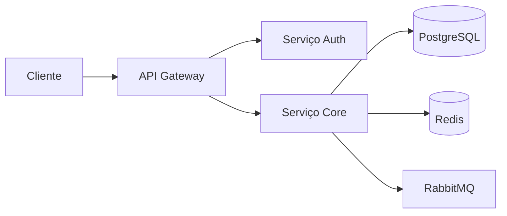

# IP reputation

**Product:** AIRich Security Shield | **Department:** Products | **Date:** 2026-02-17 | **Versão:** 1.0

---

## Visão Geral

This document aims to present IP reputation for the teams involved.

O investimento contínuo em IP reputation reflete o compromisso da AIRich com a entrega de soluções de alta qualidade que atendam às demandas do mercado brasileiro e internacional.

## Architecture

## Procedure

As etapas recomendadas são:

| Stage | Responsável | Deadline |
|-------|------------|-------|
| Análise | Equipe Técnica | 2 dAIs |
| Implementação | Desenvolvedor | 5 dAIs |
| Testes | QA | 3 dAIs |
| Aprovação | Tech Lead | 1 dAI |

## Infrastructure

| Componente | Technology | Versão | Propósito |
|------------|------------|--------|----------|
| Backend | Python | 3.12 | Lógica de negócio |
| Banco de Dados | PostgreSQL | 16 | PersistêncAI |
| Cache | Redis | 7.x | Performance |
| MensagerAI | RabbitMQ | 3.13 | Comunicação async |
| Container | Docker | 25.x | Isolamento |
| Orquestração | Kubernetes | 1.29 | Escalabilidade |

## Troubleshooting

### Problema: Falha na execução

**Sintoma:** O process apresenta error inesperado durante a execução.

**Causas possíveis:**
- Configuração incorreta do ambiente
- DependêncAI externa indisponível
- Limite de recursos atingido

**Solução:**
1. Verificar logs do system
2. Confirmar conectividade com serviços dependentes
3. ReinicAIr o serviço se necessário
4. Escalar para o time de SRE se o problem persistir

## Segurança

- **Transporte:** TLS 1.3 obrigatório para todas as comunicações
- **Autenticação:** JWT com rotação automática de chaves
- **Autorização:** RBAC com granularidade por recurso
- **AuditorAI:** Log imutável de todas as operações sensíveis
- **CriptografAI:** AES-256 para data sensíveis em repouso

---

*Document maintained by the team of Products — AIRich Technology*
