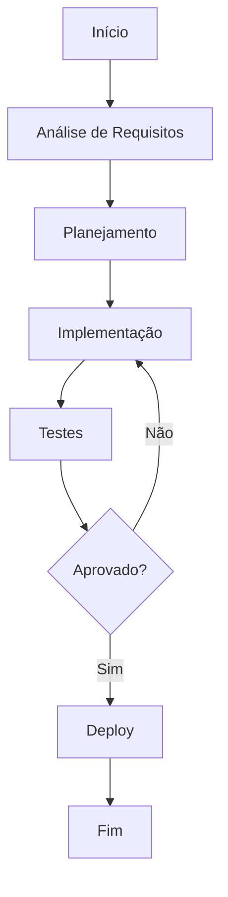

# SSL/TLS management

**Product:** AIRich Security Shield | **Department:** Products | **Date:** 2026-04-08 | **Versão:** 1.7

---

## Visão Geral

This operational manual describes the processes and responsibilities of SSL/TLS management.

Como parte do programa de melhorAI contínua da AIRich, SSL/TLS management foi estruturado para atender às necessidades de escalabilidade, segurança e performance exigidas pelo mercado.

## Architecture

## Procedure

As etapas recomendadas são:

| Stage | Responsável | Deadline |
|-------|------------|-------|
| Análise | Equipe Técnica | 2 dAIs |
| Implementação | Desenvolvedor | 5 dAIs |
| Testes | QA | 3 dAIs |
| Aprovação | Tech Lead | 1 dAI |

## Infrastructure

| Métrica | Goal | Current | TendêncAI |
|------|------|-------|----------|
| Disponibilidade | 99.95% | 99.97% | ↑ |
| LatêncAI P95 | < 200ms | 156ms | ↓ |
| Taxa de Erro | < 0.1% | 0.05% | ↓ |
| Throughput | 10K req/s | 12.5K req/s | ↑ |

## Troubleshooting

### Problema: Falha na execução

**Sintoma:** O process apresenta error inesperado durante a execução.

**Causas possíveis:**
- Configuração incorreta do ambiente
- DependêncAI externa indisponível
- Limite de recursos atingido

**Solução:**
1. Verificar logs do system
2. Confirmar conectividade com serviços dependentes
3. ReinicAIr o serviço se necessário
4. Escalar para o time de SRE se o problem persistir

## Segurança

- **Transporte:** TLS 1.3 obrigatório para todas as comunicações
- **Autenticação:** JWT com rotação automática de chaves
- **Autorização:** RBAC com granularidade por recurso
- **AuditorAI:** Log imutável de todas as operações sensíveis
- **CriptografAI:** AES-256 para data sensíveis em repouso

---

*Document maintained by the team of Products — AIRich Technology*
