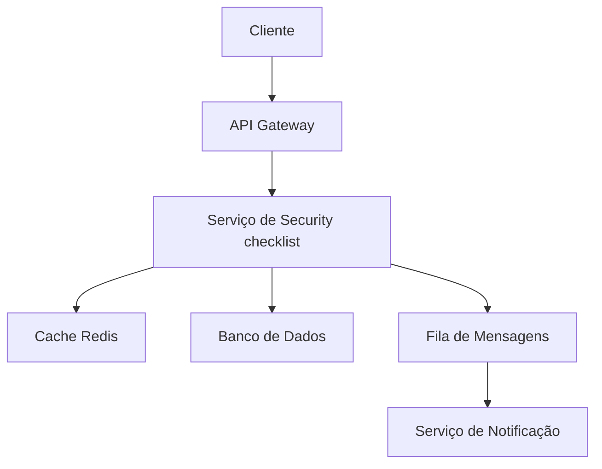

# Security checklist

**Produto:** AIRich Security Shield  
**Departamento:** Produtos  
**Data:** 2026-06-14  
**Versão:** 3.1  
**Autor:** Equipe de Produto AIRich

---

## Índice

1. [Introdução](#introdução)
2. [Visão Geral](#visão-geral)
3. [Detalhes Técnicos](#detalhes-técnicos)
4. [Implementação](#implementação)
5. [Exemplos de Uso](#exemplos-de-uso)
6. [Melhores Práticas](#melhores-práticas)
7. [Troubleshooting](#troubleshooting)
8. [Referências](#referências)

---

## Métricas e Monitoramento

O security checklist é monitorado 24/7 através de:

- **Latência:** P50 < 50ms, P95 < 200ms, P99 < 500ms
- **Disponibilidade:** SLA de 99.95% mensal
- **Taxa de Erro:** Meta < 0.1% das requisições
- **Throughput:** Suporta até 10.000 req/s por instância

## Detalhes de Implementação

A implementação do security checklist utiliza tecnologias modernas e consolidadas no mercado:

| Tecnologia | Versão | Propósito |
|-----------|--------|-----------|
| Python | 3.12 | Backend principal |
| PostgreSQL | 16 | Banco de dados relacional |
| Redis | 7.x | Cache e sessões |
| RabbitMQ | 3.13 | Mensageria assíncrona |
| Docker | 25.x | Containerização |
| Kubernetes | 1.29 | Orquestração |

## Roadmap

### Q2 2026
- [ ] Implementação de cache distribuído
- [ ] Suporte a webhooks customizáveis
- [ ] Dashboard de métricas em tempo real
- [ ] Integração com Slack e Teams

### Q3 2026
- [ ] Machine Learning para detecção de anomalias
- [ ] Suporte multi-região
- [ ] API GraphQL
- [ ] SDK para Go e Rust

### Q4 2026
- [ ] Migração para arquitetura event-driven
- [ ] Suporte a edge computing
- [ ] Certificação SOC2 Tipo II
- [ ] Programa de parceiros

## Histórico de Versões

| Versão | Data | Autor | Descrição |
|--------|------|-------|-----------|
| 1.0 | 2025-01-15 | Equipe Produto | Versão inicial |
| 1.1 | 2025-03-22 | Equipe Produto | Correções de bugs |
| 2.0 | 2025-06-10 | Equipe Produto | Redesign completo |
| 2.1 | 2025-09-05 | Equipe Produto | Novas funcionalidades |
| 3.0 | 2026-01-20 | Equipe Produto | Arquitetura v3 |

## Apêndice B: Referências

1. Documentação oficial do AIRich Security Shield
2. Guia de arquitetura AIRich v3.0
3. Manual de segurança da informação
4. Políticas de desenvolvimento AIRich
5. ISO 27001:2022 - Segurança da Informação

## Introdução

O security checklist é um dos pilares fundamentais do AIRich Security Shield, parte integrante do ecossistema de produtos da AIRich Tecnologia. Desde sua concepção, este componente foi projetado para atender empresas de diversos portes, desde startups até grandes corporações com operações em múltiplos países.

A AIRich Tecnologia, fundada em 2019, tem como missão democratizar o acesso a ferramentas de tecnologia de ponta para o mercado brasileiro e latino-americano. O AIRich Security Shield é resultado direto dessa visão, combinando inovação tecnológica com profundo entendimento das necessidades do mercado local.

## Segurança

A segurança do security checklist é tratada em múltiplas camadas:

- **Transporte:** TLS 1.3 obrigatório
- **Autenticação:** JWT com rotação de chaves
- **Autorização:** RBAC com granularidade fina
- **Auditoria:** Log imutável de todas as operações
- **Criptografia:** AES-256 para dados sensíveis em repouso

## Apêndice A: Glossário

| Termo | Definição |
|-------|----------|
| Tenant | Instância isolada de um cliente |
| RBAC | Role-Based Access Control |
| JWT | JSON Web Token |
| SLA | Service Level Agreement |
| P95 | Percentil 95 de latência |

## Fluxo de Operação

O fluxo típico de operação do security checklist segue as seguintes etapas:

1. **Recepção:** A requisição é recebida via API Gateway e validada
2. **Autenticação:** Token JWT é verificado e permissões são checadas
3. **Processamento:** Regras de negócio são aplicadas
4. **Persistência:** Dados são armazenados no banco de dados
5. **Notificação:** Eventos são publicados na fila de mensagens
6. **Resposta:** Resultado é retornado ao cliente

## Visão Geral da Arquitetura

A arquitetura do security checklist segue o padrão de microsserviços, permitindo escalabilidade independente e facilitando a manutenção. O sistema é composto por:

- **Camada de API:** Responsável por receber e validar todas as requisições
- **Camada de Negócio:** Contém as regras de negócio e orquestração de processos
- **Camada de Dados:** Gerencia persistência e cache distribuído
- **Camada de Integração:** Comunicação com serviços externos e mensageria

## Segurança

A segurança do security checklist é tratada em múltiplas camadas:

- **Transporte:** TLS 1.3 obrigatório
- **Autenticação:** JWT com rotação de chaves
- **Autorização:** RBAC com granularidade fina
- **Auditoria:** Log imutável de todas as operações
- **Criptografia:** AES-256 para dados sensíveis em repouso

## Visão Geral da Arquitetura

A arquitetura do security checklist segue o padrão de microsserviços, permitindo escalabilidade independente e facilitando a manutenção. O sistema é composto por:

- **Camada de API:** Responsável por receber e validar todas as requisições
- **Camada de Negócio:** Contém as regras de negócio e orquestração de processos
- **Camada de Dados:** Gerencia persistência e cache distribuído
- **Camada de Integração:** Comunicação com serviços externos e mensageria

## Apêndice A: Glossário

| Termo | Definição |
|-------|----------|
| Tenant | Instância isolada de um cliente |
| RBAC | Role-Based Access Control |
| JWT | JSON Web Token |
| SLA | Service Level Agreement |
| P95 | Percentil 95 de latência |

## Fluxo de Operação

O fluxo típico de operação do security checklist segue as seguintes etapas:

1. **Recepção:** A requisição é recebida via API Gateway e validada
2. **Autenticação:** Token JWT é verificado e permissões são checadas
3. **Processamento:** Regras de negócio são aplicadas
4. **Persistência:** Dados são armazenados no banco de dados
5. **Notificação:** Eventos são publicados na fila de mensagens
6. **Resposta:** Resultado é retornado ao cliente

## Detalhes de Implementação

A implementação do security checklist utiliza tecnologias modernas e consolidadas no mercado:

| Tecnologia | Versão | Propósito |
|-----------|--------|-----------|
| Python | 3.12 | Backend principal |
| PostgreSQL | 16 | Banco de dados relacional |
| Redis | 7.x | Cache e sessões |
| RabbitMQ | 3.13 | Mensageria assíncrona |
| Docker | 25.x | Containerização |
| Kubernetes | 1.29 | Orquestração |

