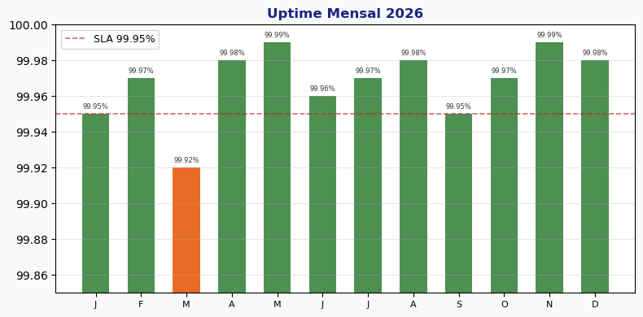

# Security monitoring

**Produto:** AIRich Security Shield | **Departamento:** Produtos | **Data:** 2026-06-22

---

## Visão Geral

Este manual operacional descreve os processos e responsabilidades de Security monitoring.

Alinhado com as melhores práticas do mercado, Security monitoring segue padrões estabelecidos pelas equipes de engenharia e operações da AIRich Tecnologia.

## Procedimento

As etapas recomendadas são:

| Etapa | Responsável | Prazo |
|-------|------------|-------|
| Análise | Equipe Técnica | 2 dias |
| Implementação | Desenvolvedor | 5 dias |
| Testes | QA | 3 dias |
| Aprovação | Tech Lead | 1 dia |

## Infraestrutura

| Métrica | Meta | Atual | Tendência |
|------|------|-------|----------|
| Disponibilidade | 99.95% | 99.97% | ↑ |
| Latência P95 | < 200ms | 156ms | ↓ |
| Taxa de Erro | < 0.1% | 0.05% | ↓ |
| Throughput | 10K req/s | 12.5K req/s | ↑ |

---

*Documento mantido pela equipe de Produtos — AIRich Tecnologia*
