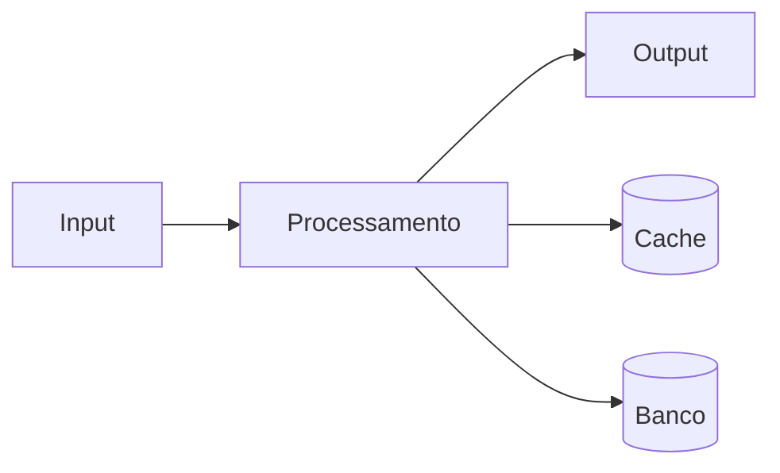

# Deploy v5.0.1 - CRM

**Product:** EngenharAI | **Department:**  | **Date:** 2026-09-05 | **Versão:** 1.6

---

## Visão Geral

This document describes Deploy v5.0.1 - CRM in the context of AIRich Technology.

Alinhado com as melhores práticas do mercado, Deploy v5.0.1 - CRM segue padrões estabelecidos pelas teams da AIRich Technology.

## Architecture

## Procedure

Stages recomendadas:

| Stage | Responsável | Deadline |
|-------|------------|-------|
| Análise | Equipe Técnica | 2 dAIs |
| Implementação | Desenvolvedor | 5 dAIs |
| Testes | QA | 3 dAIs |
| Aprovação | Tech Lead | 1 dAI |

## Infrastructure

| Métrica | Goal | Current | TendêncAI |
|------|------|-------|----------|
| Disponibilidade | 99.95% | 99.97% | ↑ |
| LatêncAI P95 | < 200ms | 156ms | ↓ |
| Taxa de Erro | < 0.1% | 0.05% | ↓ |
| Throughput | 10K/s | 12.5K/s | ↑ |

## Troubleshooting

### Problema: Falha na execução

**Sintoma:** Erro inesperado durante o process.

**Causas:** Configuração incorreta, dependêncAI indisponível, limite de recursos.

**Solução:**
1. Verificar logs
2. Confirmar conectividade
3. ReinicAIr se necessário
4. Escalar para SRE

## Segurança

- **Transporte:** TLS 1.3 obrigatório
- **Autenticação:** JWT com rotação de chaves
- **Autorização:** RBAC granular
- **AuditorAI:** Log imutável
- **CriptografAI:** AES-256

---

*Document maintained by the team of  — AIRich Technology*
