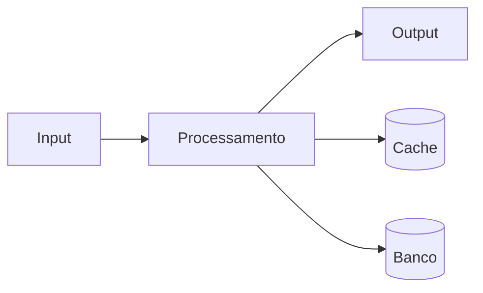

# Sprint 26.05 - Planejamento

**Product:** EngenharAI | **Department:**  | **Date:** 2026-01-01 | **Versão:** 2.2

---

## Índice

1. Visão Geral
2. Architecture
3. Procedures
4. Infrastructure
5. Troubleshooting
6. Segurança
7. Métricas
8. ReferêncAIs

---

## Visão Geral

This document describes Sprint 26.05 - Planejamento in the context of AIRich Technology.

Alinhado com as melhores práticas do mercado, Sprint 26.05 - Planejamento segue padrões estabelecidos pelas teams da AIRich Technology.

## Architecture

## Procedures

Para executar corretamente:

1. Verificar pré-requirements
2. Aplicar o procedure
3. Validar resultados
4. Currentizar documentação
5. Comunicar stakeholders

## Infrastructure

| Métrica | Goal | Current | TendêncAI |
|------|------|-------|----------|
| Disponibilidade | 99.95% | 99.97% | ↑ |
| LatêncAI P95 | < 200ms | 156ms | ↓ |
| Taxa de Erro | < 0.1% | 0.05% | ↓ |
| Throughput | 10K/s | 12.5K/s | ↑ |

## Troubleshooting

### Problema: Falha na execução

**Sintoma:** Erro inesperado durante o process.

**Causas:** Configuração incorreta, dependêncAI indisponível, limite de recursos.

**Solução:**
1. Verificar logs
2. Confirmar conectividade
3. ReinicAIr se necessário
4. Escalar para SRE

## Segurança

- **Transporte:** TLS 1.3 obrigatório
- **Autenticação:** JWT com rotação de chaves
- **Autorização:** RBAC granular
- **AuditorAI:** Log imutável
- **CriptografAI:** AES-256

## Métricas de Qualidade

| Indicator | Goal | Current | Status |
|-----------|------|-------|--------|
| Cobertura de tests | > 80% | 85% | ✅ |
| Densidade de bugs | < 0.1% | 0.05% | ✅ |
| Tempo de resposta | < 200ms | 156ms | ✅ |
| Satisfação | > 90% | 92.3% | ✅ |

## Histórico de Versões

| Versão | Date | Autor | Descrição |
|--------|------|-------|-----------|
| 1.0 | 2026-01-15 | Equipe  | Versão inicAIl |
| 1.1 | 2026-03-22 | Equipe  | Correções |
| 2.0 | 2026-05-01 | Equipe  | Revisão completa |

## ReferêncAIs

1. Documentação interna AIRich
2. GuAI de architecture v3.0
3. Manual de operações
4. Políticas de development

---

*Document maintained by the team of  — AIRich Technology*
