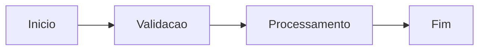

# Story points guide

**Depto:** Sprints  
**Data:** 2026-02-25

---

## Introducao

Story points guide e fundamental para a AIRich. Orientacoes detalhadas para engenharia.

## Detalhes Tecnicos

| Comp | Tech | Versao |
|------|------|--------|
| Backend | Python | 3.12 |
| Banco | PostgreSQL | 16 |
| Cache | Redis | 7.x |

## Troubleshooting

### Problema

**Sintoma:** Falha em story points guide

**Solucao:**
1. Verificar logs
2. Confirmar conectividade
3. Reiniciar se necessario

## Seguranca

- TLS 1.3 obrigatorio
- JWT com rotacao
- RBAC granular
- Auditoria completa

## Introducao

Story points guide e fundamental para a AIRich. Orientacoes detalhadas para engenharia.

## Detalhes Tecnicos

| Comp | Tech | Versao |
|------|------|--------|
| Backend | Python | 3.12 |
| Banco | PostgreSQL | 16 |
| Cache | Redis | 7.x |

