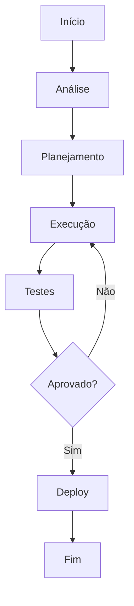

# KB: Workarounds

**Produto:** Suporte | **Departamento:**  | **Data:** 2026-04-03 | **Versão:** 1.0

---

## Visão Geral

O presente documento tem como objetivo apresentar KB: Workarounds para as equipes envolvidas.

Alinhado com as melhores práticas do mercado, KB: Workarounds segue padrões estabelecidos pelas equipes da AIRich Tecnologia.

## Arquitetura

## Procedimento

Etapas recomendadas:

| Etapa | Responsável | Prazo |
|-------|------------|-------|
| Análise | Equipe Técnica | 2 dias |
| Implementação | Desenvolvedor | 5 dias |
| Testes | QA | 3 dias |
| Aprovação | Tech Lead | 1 dia |

## Infraestrutura

| Métrica | Meta | Atual | Tendência |
|------|------|-------|----------|
| Disponibilidade | 99.95% | 99.97% | ↑ |
| Latência P95 | < 200ms | 156ms | ↓ |
| Taxa de Erro | < 0.1% | 0.05% | ↓ |
| Throughput | 10K/s | 12.5K/s | ↑ |

## Troubleshooting

### Problema: Falha na execução

**Sintoma:** Erro inesperado durante o processo.

**Causas:** Configuração incorreta, dependência indisponível, limite de recursos.

**Solução:**
1. Verificar logs
2. Confirmar conectividade
3. Reiniciar se necessário
4. Escalar para SRE

## Segurança

- **Transporte:** TLS 1.3 obrigatório
- **Autenticação:** JWT com rotação de chaves
- **Autorização:** RBAC granular
- **Auditoria:** Log imutável
- **Criptografia:** AES-256

---

*Documento mantido pela equipe de  — AIRich Tecnologia*
