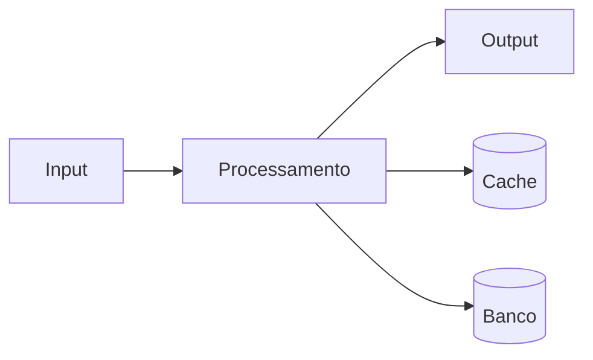

# Runbook: Escalacao nivel 3

**Product:** Suporte | **Department:**  | **Date:** 2026-07-24 | **Versão:** 1.3

---

## Visão Geral

This document describes Runbook: Escalacao nivel 3 in the context of AIRich Technology.

A team da AIRich trabalha continuamente na evolução de Runbook: Escalacao nivel 3, incorporando feedback e avanços tecnológicos.

## Architecture

## Procedure

O procedure padrão segue as seguintes etapas:

1. **Identificação** — Reconhecer o escopo e requirements
2. **Planejamento** — Definir recursos e cronograma
3. **Execução** — Implementar conforme especificações
4. **Validação** — Verificar critérios de aceite
5. **Documentação** — Registrar ações e decisões

## Infrastructure

| Componente | Technology | Versão | Propósito |
|------------|------------|--------|----------|
| Backend | Python | 3.12 | Lógica de negócio |
| Banco | PostgreSQL | 16 | PersistêncAI |
| Cache | Redis | 7.x | Performance |
| Fila | RabbitMQ | 3.13 | MensagerAI |
| Docker | Docker | 25.x | Container |
| K8s | Kubernetes | 1.29 | Orquestração |

## Troubleshooting

### Problema: Falha na execução

**Sintoma:** Erro inesperado durante o process.

**Causas:** Configuração incorreta, dependêncAI indisponível, limite de recursos.

**Solução:**
1. Verificar logs
2. Confirmar conectividade
3. ReinicAIr se necessário
4. Escalar para SRE

## Segurança

- **Transporte:** TLS 1.3 obrigatório
- **Autenticação:** JWT com rotação de chaves
- **Autorização:** RBAC granular
- **AuditorAI:** Log imutável
- **CriptografAI:** AES-256

---

*Document maintained by the team of  — AIRich Technology*
