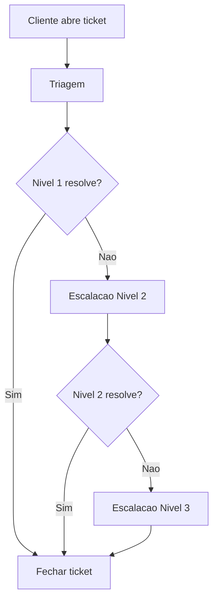

# FAQ: Como mudar idioma

**Depto:** Suporte  
**Data:** 2026-09-16

---

## Indice

1. Introducao
2. Processo
3. Metricas
4. Troubleshooting
5. Referencias

---

## Introducao

FAQ: Como mudar idioma e parte do processo de suporte da AIRich Tecnologia. Este documento orienta a equipe de atendimento ao cliente.

## Detalhes do Processo

## Metricas de Atendimento

| Metrica | Meta | Atual |
|---------|------|-------|
| CSAT | > 90% | 92.3% |
| NPS | > 50 | 58 |
| TMA | < 5min | 3.8min |
| Resolucao 1o contato | > 70% | 73.1% |

## Troubleshooting

### Problema: Cliente nao consegue acessar

**Sintoma:** Login retorna erro 401

**Solucao:**
1. Verificar credenciais
2. Checar status da conta
3. Verificar se MFA esta ativo
4. Resetar senha se necessario

## Base de Conhecimento Relacionada

- KB-001: Visao geral do produto
- KB-042: Erros de autenticacao
- KB-103: Guia de troubleshooting
- RUN-007: Runbook de login

## Historico de Alteracoes

| Versao | Data | Autor | Alteracao |
|--------|------|-------|----------|
| 1.0 | 2026-01-10 | Suporte | Versao inicial |
| 1.1 | 2026-03-15 | Suporte | Novos cenarios |
| 2.0 | 2026-05-01 | Suporte | Revisao completa |

## Base de Conhecimento Relacionada

- KB-001: Visao geral do produto
- KB-042: Erros de autenticacao
- KB-103: Guia de troubleshooting
- RUN-007: Runbook de login

## Introducao

FAQ: Como mudar idioma e parte do processo de suporte da AIRich Tecnologia. Este documento orienta a equipe de atendimento ao cliente.

## Troubleshooting

### Problema: Cliente nao consegue acessar

**Sintoma:** Login retorna erro 401

**Solucao:**
1. Verificar credenciais
2. Checar status da conta
3. Verificar se MFA esta ativo
4. Resetar senha se necessario

