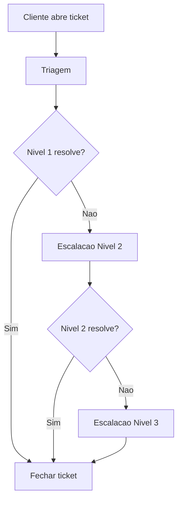

# Runbook: Problema de relatorio

**Depto:** Suporte  
**Data:** 2026-03-28

---

## Introducao

Runbook: Problema de relatorio e parte do processo de suporte da AIRich Tecnologia. Este documento orienta a equipe de atendimento ao cliente.

## Detalhes do Processo

## Metricas de Atendimento

| Metrica | Meta | Atual |
|---------|------|-------|
| CSAT | > 90% | 92.3% |
| NPS | > 50 | 58 |
| TMA | < 5min | 3.8min |
| Resolucao 1o contato | > 70% | 73.1% |

## Troubleshooting

### Problema: Cliente nao consegue acessar

**Sintoma:** Login retorna erro 401

**Solucao:**
1. Verificar credenciais
2. Checar status da conta
3. Verificar se MFA esta ativo
4. Resetar senha se necessario

## Detalhes do Processo

## Introducao

Runbook: Problema de relatorio e parte do processo de suporte da AIRich Tecnologia. Este documento orienta a equipe de atendimento ao cliente.

