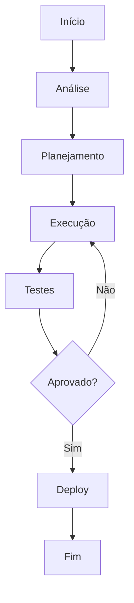

# Escopo de servicos

**Produto:** Vendas | **Departamento:**  | **Data:** 2026-01-09 | **Versão:** 1.6

---

## Visão Geral

O presente documento tem como objetivo apresentar Escopo de servicos para as equipes envolvidas.

Como parte da estratégia de inovação, Escopo de servicos foi projetado para suportar o crescimento escalável da plataforma.

## Arquitetura

## Procedimento

O procedimento padrão segue as seguintes etapas:

1. **Identificação** — Reconhecer o escopo e requisitos
2. **Planejamento** — Definir recursos e cronograma
3. **Execução** — Implementar conforme especificações
4. **Validação** — Verificar critérios de aceite
5. **Documentação** — Registrar ações e decisões

## Infraestrutura

| Métrica | Meta | Atual | Tendência |
|------|------|-------|----------|
| Disponibilidade | 99.95% | 99.97% | ↑ |
| Latência P95 | < 200ms | 156ms | ↓ |
| Taxa de Erro | < 0.1% | 0.05% | ↓ |
| Throughput | 10K/s | 12.5K/s | ↑ |

## Troubleshooting

### Problema: Falha na execução

**Sintoma:** Erro inesperado durante o processo.

**Causas:** Configuração incorreta, dependência indisponível, limite de recursos.

**Solução:**
1. Verificar logs
2. Confirmar conectividade
3. Reiniciar se necessário
4. Escalar para SRE

## Segurança

- **Transporte:** TLS 1.3 obrigatório
- **Autenticação:** JWT com rotação de chaves
- **Autorização:** RBAC granular
- **Auditoria:** Log imutável
- **Criptografia:** AES-256

---

*Documento mantido pela equipe de  — AIRich Tecnologia*
