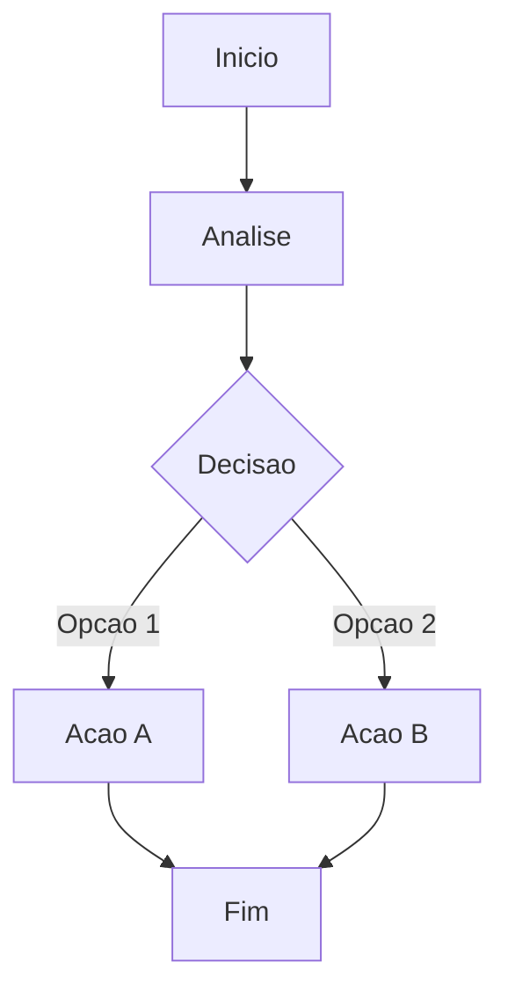

# Proposta: Cliente Delta

**Depto:** Propostas  
**Data:** 2026-01-12

---

## Indice

1. Introducao
2. Detalhes
3. Procedimentos
4. Metricas
5. Referencias

---

## Introducao

Proposta: Cliente Delta e parte das operacoes da AIRich. Este documento fornece orientacoes detalhadas.

## Detalhes

| Item | Descricao | Status |
|------|-----------|--------|
| A | Item A | Ativo |
| B | Item B | Ativo |
| C | Item C | Pendente |

## Troubleshooting

### Problema

**Sintoma:** Falha durante processo

**Solucao:**
1. Verificar logs
2. Confirmar configuracao
3. Reiniciar se necessario

## Seguranca

- Acesso controlado
- Auditoria completa
- Dados criptografados

## Metricas

| Metrica | Meta | Atual |
|---------|------|-------|
| Eficiencia | > 90% | 92% |
| Qualidade | > 95% | 96% |

## Referencias

1. Documentacao interna AIRich
2. Guia do departamento
3. Manual de operacoes

## Detalhes

| Item | Descricao | Status |
|------|-----------|--------|
| A | Item A | Ativo |
| B | Item B | Ativo |
| C | Item C | Pendente |

## Introducao

Proposta: Cliente Delta e parte das operacoes da AIRich. Este documento fornece orientacoes detalhadas.

## Troubleshooting

### Problema

**Sintoma:** Falha durante processo

**Solucao:**
1. Verificar logs
2. Confirmar configuracao
3. Reiniciar se necessario

