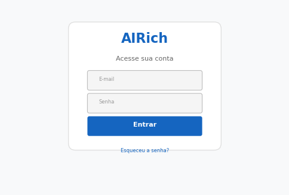

# Onboarding: Mentoria

**Produto:** RH | **Departamento:**  | **Data:** 2026-07-01

---

## Visão Geral

Este documento descreve Onboarding: Mentoria no contexto da AIRich Tecnologia.

O investimento contínuo em Onboarding: Mentoria reflete o compromisso da AIRich com a entrega de soluções de alta qualidade.

## Procedimento

Para executar corretamente:

1. Verificar pré-requisitos
2. Aplicar o procedimento
3. Validar resultados
4. Atualizar documentação
5. Comunicar stakeholders

## Infraestrutura

| Componente | Tecnologia | Versão | Propósito |
|------------|------------|--------|----------|
| Backend | Python | 3.12 | Lógica de negócio |
| Banco | PostgreSQL | 16 | Persistência |
| Cache | Redis | 7.x | Performance |
| Fila | RabbitMQ | 3.13 | Mensageria |
| Docker | Docker | 25.x | Container |
| K8s | Kubernetes | 1.29 | Orquestração |

---

*Documento mantido pela equipe de  — AIRich Tecnologia*
