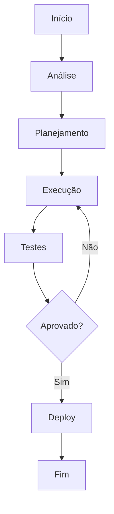

# Politica: Horario flexivel

**Product:** RH | **Department:**  | **Date:** 2026-09-22 | **Versão:** 2.1

---

## Índice

1. Visão Geral
2. Architecture
3. Procedures
4. Infrastructure
5. Troubleshooting
6. Segurança
7. Métricas
8. ReferêncAIs

---

## Visão Geral

This operational manual describes the processes and responsibilities of Politica: Horario flexivel.

Como parte do programa de melhorAI contínua da AIRich, Politica: Horario flexivel foi estruturado para atender às necessidades de escalabilidade e segurança.

## Architecture

## Procedures

O procedure padrão segue as seguintes etapas:

1. **Identificação** — Reconhecer o escopo e requirements
2. **Planejamento** — Definir recursos e cronograma
3. **Execução** — Implementar conforme especificações
4. **Validação** — Verificar critérios de aceite
5. **Documentação** — Registrar ações e decisões

## Infrastructure

| Componente | Technology | Versão | Propósito |
|------------|------------|--------|----------|
| Backend | Python | 3.12 | Lógica de negócio |
| Banco | PostgreSQL | 16 | PersistêncAI |
| Cache | Redis | 7.x | Performance |
| Fila | RabbitMQ | 3.13 | MensagerAI |
| Docker | Docker | 25.x | Container |
| K8s | Kubernetes | 1.29 | Orquestração |

## Troubleshooting

### Problema: Falha na execução

**Sintoma:** Erro inesperado durante o process.

**Causas:** Configuração incorreta, dependêncAI indisponível, limite de recursos.

**Solução:**
1. Verificar logs
2. Confirmar conectividade
3. ReinicAIr se necessário
4. Escalar para SRE

## Segurança

- **Transporte:** TLS 1.3 obrigatório
- **Autenticação:** JWT com rotação de chaves
- **Autorização:** RBAC granular
- **AuditorAI:** Log imutável
- **CriptografAI:** AES-256

## Métricas de Qualidade

| Indicator | Goal | Current | Status |
|-----------|------|-------|--------|
| Cobertura de tests | > 80% | 85% | ✅ |
| Densidade de bugs | < 0.1% | 0.05% | ✅ |
| Tempo de resposta | < 200ms | 156ms | ✅ |
| Satisfação | > 90% | 92.3% | ✅ |

## Histórico de Versões

| Versão | Date | Autor | Descrição |
|--------|------|-------|-----------|
| 1.0 | 2026-01-15 | Equipe  | Versão inicAIl |
| 1.1 | 2026-03-22 | Equipe  | Correções |
| 2.0 | 2026-05-01 | Equipe  | Revisão completa |

## ReferêncAIs

1. Documentação interna AIRich
2. GuAI de architecture v3.0
3. Manual de operações
4. Políticas de development

---

*Document maintained by the team of  — AIRich Technology*
