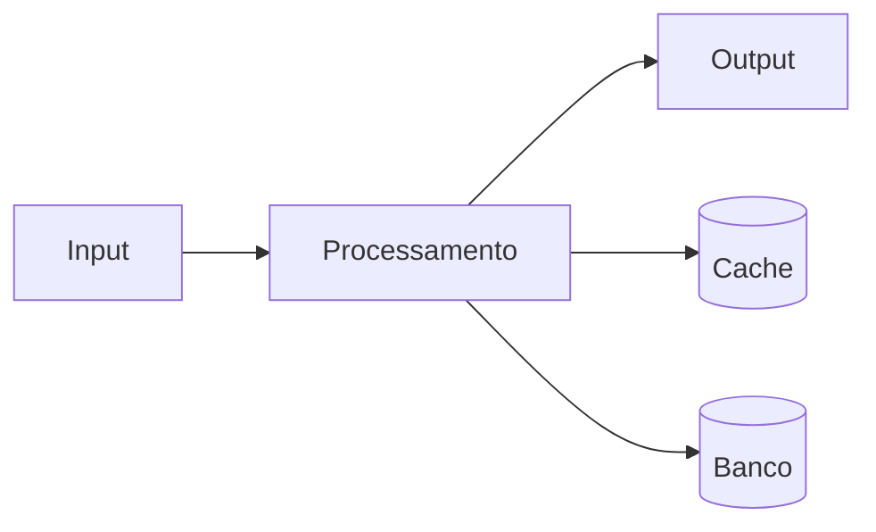

# Politica: Uso de internet

**Product:** RH | **Department:**  | **Date:** 2026-07-19 | **Versão:** 1.6

---

## Visão Geral

This operational manual describes the processes and responsibilities of Politica: Uso de internet.

A team da AIRich trabalha continuamente na evolução de Politica: Uso de internet, incorporando feedback e avanços tecnológicos.

## Architecture

## Procedure

Stages recomendadas:

| Stage | Responsável | Deadline |
|-------|------------|-------|
| Análise | Equipe Técnica | 2 dAIs |
| Implementação | Desenvolvedor | 5 dAIs |
| Testes | QA | 3 dAIs |
| Aprovação | Tech Lead | 1 dAI |

## Infrastructure

| Componente | Technology | Versão | Propósito |
|------------|------------|--------|----------|
| Backend | Python | 3.12 | Lógica de negócio |
| Banco | PostgreSQL | 16 | PersistêncAI |
| Cache | Redis | 7.x | Performance |
| Fila | RabbitMQ | 3.13 | MensagerAI |
| Docker | Docker | 25.x | Container |
| K8s | Kubernetes | 1.29 | Orquestração |

## Troubleshooting

### Problema: Falha na execução

**Sintoma:** Erro inesperado durante o process.

**Causas:** Configuração incorreta, dependêncAI indisponível, limite de recursos.

**Solução:**
1. Verificar logs
2. Confirmar conectividade
3. ReinicAIr se necessário
4. Escalar para SRE

## Segurança

- **Transporte:** TLS 1.3 obrigatório
- **Autenticação:** JWT com rotação de chaves
- **Autorização:** RBAC granular
- **AuditorAI:** Log imutável
- **CriptografAI:** AES-256

---

*Document maintained by the team of  — AIRich Technology*
