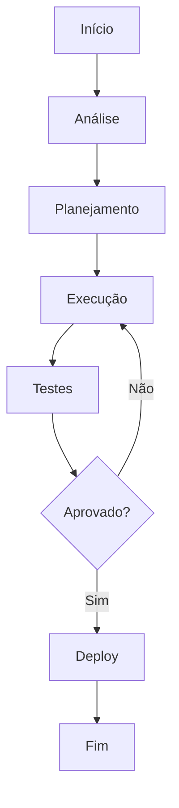

# NF-e: Out 2026

**Product:** Financeiro | **Department:**  | **Date:** 2026-03-02 | **Versão:** 1.9

---

## Visão Geral

Este guAI técnico aborda os aspectos fundamentais de NF-e: Out 2026 at AIRich.

Alinhado com as melhores práticas do mercado, NF-e: Out 2026 segue padrões estabelecidos pelas teams da AIRich Technology.

## Architecture

## Procedure

Para executar corretamente:

1. Verificar pré-requirements
2. Aplicar o procedure
3. Validar resultados
4. Currentizar documentação
5. Comunicar stakeholders

## Infrastructure

| Componente | Technology | Versão | Propósito |
|------------|------------|--------|----------|
| Backend | Python | 3.12 | Lógica de negócio |
| Banco | PostgreSQL | 16 | PersistêncAI |
| Cache | Redis | 7.x | Performance |
| Fila | RabbitMQ | 3.13 | MensagerAI |
| Docker | Docker | 25.x | Container |
| K8s | Kubernetes | 1.29 | Orquestração |

## Troubleshooting

### Problema: Falha na execução

**Sintoma:** Erro inesperado durante o process.

**Causas:** Configuração incorreta, dependêncAI indisponível, limite de recursos.

**Solução:**
1. Verificar logs
2. Confirmar conectividade
3. ReinicAIr se necessário
4. Escalar para SRE

## Segurança

- **Transporte:** TLS 1.3 obrigatório
- **Autenticação:** JWT com rotação de chaves
- **Autorização:** RBAC granular
- **AuditorAI:** Log imutável
- **CriptografAI:** AES-256

---

*Document maintained by the team of  — AIRich Technology*
