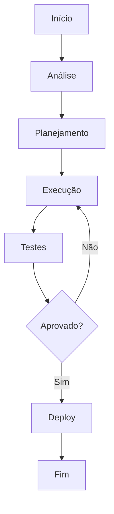

# Nota fiscal reembolso

**Produto:** Financeiro | **Departamento:**  | **Data:** 2026-01-08 | **Versão:** 1.3

---

## Visão Geral

Este manual operacional descreve os processos e responsabilidades de Nota fiscal reembolso.

Como parte da estratégia de inovação, Nota fiscal reembolso foi projetado para suportar o crescimento escalável da plataforma.

## Arquitetura

## Procedimento

Etapas recomendadas:

| Etapa | Responsável | Prazo |
|-------|------------|-------|
| Análise | Equipe Técnica | 2 dias |
| Implementação | Desenvolvedor | 5 dias |
| Testes | QA | 3 dias |
| Aprovação | Tech Lead | 1 dia |

## Infraestrutura

| Componente | Tecnologia | Versão | Propósito |
|------------|------------|--------|----------|
| Backend | Python | 3.12 | Lógica de negócio |
| Banco | PostgreSQL | 16 | Persistência |
| Cache | Redis | 7.x | Performance |
| Fila | RabbitMQ | 3.13 | Mensageria |
| Docker | Docker | 25.x | Container |
| K8s | Kubernetes | 1.29 | Orquestração |

## Troubleshooting

### Problema: Falha na execução

**Sintoma:** Erro inesperado durante o processo.

**Causas:** Configuração incorreta, dependência indisponível, limite de recursos.

**Solução:**
1. Verificar logs
2. Confirmar conectividade
3. Reiniciar se necessário
4. Escalar para SRE

## Segurança

- **Transporte:** TLS 1.3 obrigatório
- **Autenticação:** JWT com rotação de chaves
- **Autorização:** RBAC granular
- **Auditoria:** Log imutável
- **Criptografia:** AES-256

---

*Documento mantido pela equipe de  — AIRich Tecnologia*
