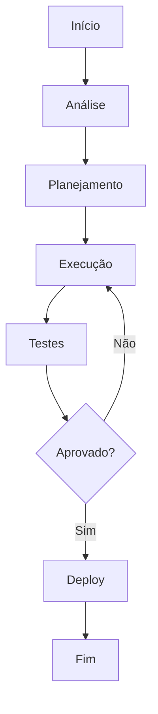

# LGPD: Legitimo interesse

**Produto:** Juridico | **Departamento:**  | **Data:** 2026-01-23 | **Versão:** 1.2

---

## Visão Geral

O objetivo deste material é documentar as práticas recomendadas para LGPD: Legitimo interesse.

Alinhado com as melhores práticas do mercado, LGPD: Legitimo interesse segue padrões estabelecidos pelas equipes da AIRich Tecnologia.

## Arquitetura

## Procedimento

O procedimento padrão segue as seguintes etapas:

1. **Identificação** — Reconhecer o escopo e requisitos
2. **Planejamento** — Definir recursos e cronograma
3. **Execução** — Implementar conforme especificações
4. **Validação** — Verificar critérios de aceite
5. **Documentação** — Registrar ações e decisões

## Infraestrutura

| Componente | Tecnologia | Versão | Propósito |
|------------|------------|--------|----------|
| Backend | Python | 3.12 | Lógica de negócio |
| Banco | PostgreSQL | 16 | Persistência |
| Cache | Redis | 7.x | Performance |
| Fila | RabbitMQ | 3.13 | Mensageria |
| Docker | Docker | 25.x | Container |
| K8s | Kubernetes | 1.29 | Orquestração |

## Troubleshooting

### Problema: Falha na execução

**Sintoma:** Erro inesperado durante o processo.

**Causas:** Configuração incorreta, dependência indisponível, limite de recursos.

**Solução:**
1. Verificar logs
2. Confirmar conectividade
3. Reiniciar se necessário
4. Escalar para SRE

## Segurança

- **Transporte:** TLS 1.3 obrigatório
- **Autenticação:** JWT com rotação de chaves
- **Autorização:** RBAC granular
- **Auditoria:** Log imutável
- **Criptografia:** AES-256

---

*Documento mantido pela equipe de  — AIRich Tecnologia*
