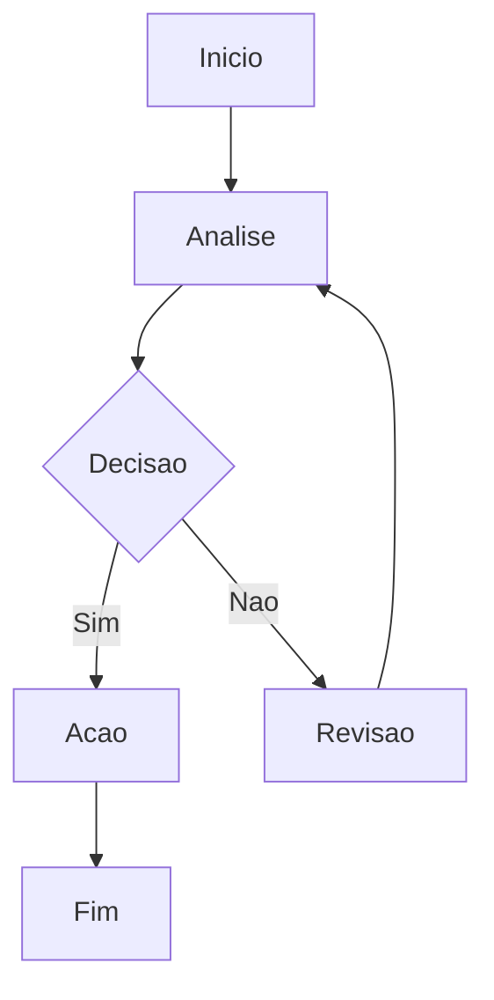

# Servidor: queue-02

**Depto:** Servidores  
**Data:** 2026-04-08

---

## Indice

1. Intro
2. Detalhes
3. Procedimentos
4. Metricas
5. Ref

---

## Introducao

Servidor: queue-02 - Servidores AIRich.

## Detalhes

| Item | Desc | Status |
|------|------|--------|
| A | A | OK |
| B | B | OK |

## Troubleshooting

**Sintoma:** Falha

**Solucao:**
1. Verificar logs
2. Reiniciar

## Seguranca

- Acesso controlado
- Auditoria

## Metricas

| Metrica | Meta | Atual |
|---------|------|-------|
| Efic. | > 90% | 92% |

## Referencias

1. Doc interna
2. Guia

## Detalhes

| Item | Desc | Status |
|------|------|--------|
| A | A | OK |
| B | B | OK |

## Seguranca

- Acesso controlado
- Auditoria

## Introducao

Servidor: queue-02 - Servidores AIRich.

