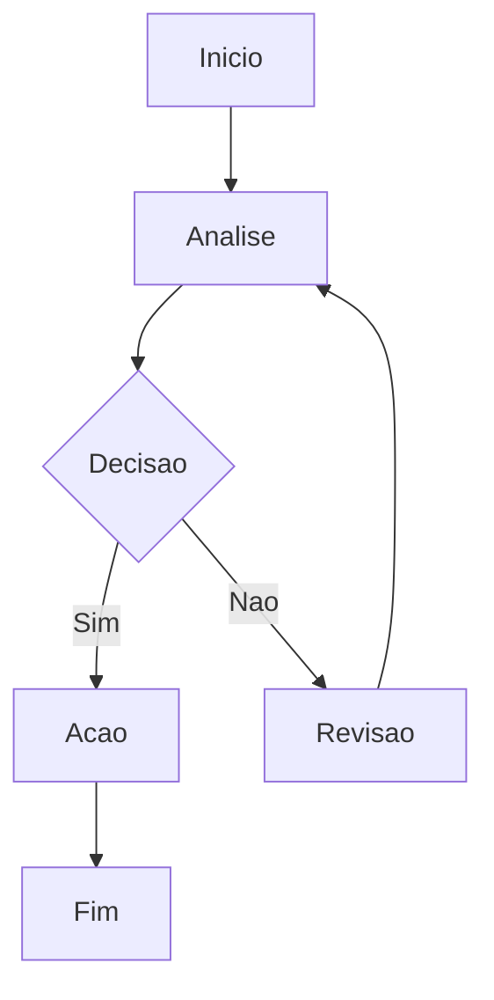

# Script: check-disk-usage.sh

**Depto:** Scripts Diagnostico  
**Data:** 2026-05-23

---

## Introducao

Script: check-disk-usage.sh - Scripts Diagnostico AIRich.

## Detalhes

| Item | Desc | Status |
|------|------|--------|
| A | A | OK |
| B | B | OK |

## Troubleshooting

**Sintoma:** Falha

**Solucao:**
1. Verificar logs
2. Reiniciar

## Seguranca

- Acesso controlado
- Auditoria

## Introducao

Script: check-disk-usage.sh - Scripts Diagnostico AIRich.

## Troubleshooting

**Sintoma:** Falha

**Solucao:**
1. Verificar logs
2. Reiniciar

