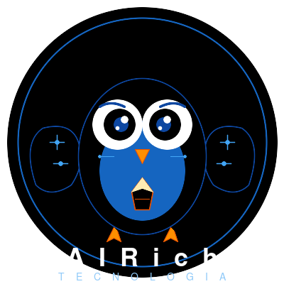

# corp-kb-ai-benchmark

> Base de conhecimento corporativa sintética para benchmark de IA

[English version](README.md)

---

## Sobre o Projeto

O **corp-kb-ai-benchmark** é uma base de conhecimento sintética que simula o dia a dia de uma empresa de tecnologia brasileira com operações internacionais. Conta com mais de **10.000 documentos em PT-BR** e aproximadamente **6.750 documentos em EN**, totalizando cerca de **16.750 arquivos markdown**.

A base foi criada com mais documentos em **PT-BR** para testar em benchmarks a capacidade de adequação a outras línguas além do EN, ES e FR (línguas mais comuns hoje em dia). Também possui versões em **EN** para comparação e avaliação de desempenho multilíngue.

A base documental inclui:

- Especificações de produto e roadmaps
- Runbooks de engenharia e suporte
- Tickets de suporte com scripts de diagnóstico
- Propostas comerciais e contratos
- Políticas de RH e compliance
- Relatórios financeiros
- Documentos jurídicos e LGPD
- Campanhas de marketing
- Documentação de infraestrutura
- Scripts operacionais em Bash e Python
- Diagramas, gráficos e ilustrações

---

## Finalidade

Esta base foi projetada para benchmark de:

- **Modelos de IA** — compreensão de contexto longo em PT-BR
- **Pipelines RAG** — recuperação em base multilíngue desorganizada
- **Search engines** — busca semântica em PT-BR vs EN
- **Knowledge management** — organização e classificação automática
- **Agentes de IA** — navegação, sumarização e cross-reference

---

## AIRich Tecnologia

<p align="center">
  
</p>

A **AIRich Tecnologia** é uma empresa de tecnologia **fictícia** criada especificamente para este benchmark. Ela simula uma empresa SaaS brasileira com operações internacionais, 10 produtos e 10 departamentos.

Todos os dados, nomes, métricas e documentos são sintéticos e foram gerados artificialmente. Qualquer semelhança com empresas reais é mera coincidência.

### Estrutura

```
corp-kb-ai-benchmark/
├── benchmarks/            # Resultados de benchmarks e avaliações
├── documents/             # Todos os documentos sintéticos
│   ├── 01-produtos/       # 1.500 docs PT-BR + 1.012 EN
│   ├── 02-engenharia/     # 2.000 docs PT-BR + 1.350 EN
│   ├── 03-suporte/        # 2.000 docs PT-BR + 1.350 EN
│   ├── 04-vendas/         # 1.200 docs PT-BR + 810 EN
│   ├── 05-rh/             # 800 docs PT-BR + 540 EN
│   ├── 06-financeiro/     # 800 docs PT-BR + 540 EN
│   ├── 07-juridico/       # 500 docs PT-BR + 338 EN
│   ├── 08-marketing/      # 500 docs PT-BR + 338 EN
│   ├── 09-infraestrutura/ # 500 docs PT-BR + 338 EN
│   └── 10-scripts/        # 200 docs PT-BR + 134 EN
├── assets/
│   └── img/               # Imagens, diagramas e logo
├── README.md              # Principal (Inglês)
└── README.pt.md           # Versão em Português
```

### Distribuição de Tamanhos (PT-BR)

| Categoria | Porcentagem | Faixa de palavras |
|-----------|------------|-------------------|
| Curta | 20% | 100-200 |
| Média | 50% | 300-500 |
| Longa | 25% | 600+ |
| Muito longa | 5% | 1500+ |

### Idiomas

- **PT-BR:** 10.000 documentos (base completa)
- **EN:** 6.750 documentos (67,5% traduzidos)
- A organização PT/EN varia por departamento para simular inconsistência real

### Produtos

1. AIRich Platform — SaaS principal
2. AIRich API Gateway
3. AIRich Mobile
4. AIRich Analytics
5. AIRich AI Assistant
6. AIRich CRM
7. AIRich DevOps Suite
8. AIRich Security Shield
9. AIRich Pay
10. AIRich Edu

---

## Licença

Apache 2.0 — Consulte [LICENSE](LICENSE) para detalhes.
