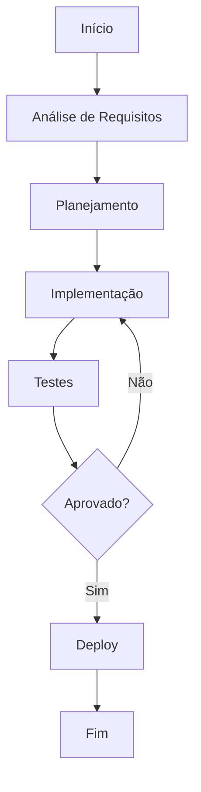

# Sistema de plugins

**Produto:** AIRich API Gateway | **Departamento:** Produtos | **Data:** 2026-06-24 | **Versão:** 1.3

---

## Visão Geral

Este documento fornece uma visão detalhada sobre Sistema de plugins no ecossistema AIRich.

O investimento contínuo em Sistema de plugins reflete o compromisso da AIRich com a entrega de soluções de alta qualidade que atendam às demandas do mercado brasileiro e internacional.

## Arquitetura

## Procedimento

O fluxo de trabalho padrão inclui:

1. **Kickoff** — Alinhamento de escopo com stakeholders
2. **Desenvolvimento** — Implementação seguindo padrões de código
3. **Code Review** — Revisão por pares antes do merge
4. **Testes** — Validação automatizada e manual
5. **Deploy** — Publicação em ambiente controlado
6. **Monitoramento** — Acompanhamento pós-deploy

## Infraestrutura

| Ambiente | URL | Status | Responsável |
|---------|-----|--------|-----------|
| Produção | app.airich.com | Ativo | SRE |
| Staging | staging.airich.com | Ativo | DevOps |
| Dev | dev.airich.com | Ativo | Engenharia |
| QA | qa.airich.com | Ativo | QA Lead |

## Troubleshooting

### Problema: Falha na execução

**Sintoma:** O processo apresenta erro inesperado durante a execução.

**Causas possíveis:**
- Configuração incorreta do ambiente
- Dependência externa indisponível
- Limite de recursos atingido

**Solução:**
1. Verificar logs do sistema
2. Confirmar conectividade com serviços dependentes
3. Reiniciar o serviço se necessário
4. Escalar para o time de SRE se o problema persistir

## Segurança

- **Transporte:** TLS 1.3 obrigatório para todas as comunicações
- **Autenticação:** JWT com rotação automática de chaves
- **Autorização:** RBAC com granularidade por recurso
- **Auditoria:** Log imutável de todas as operações sensíveis
- **Criptografia:** AES-256 para dados sensíveis em repouso

---

*Documento mantido pela equipe de Produtos — AIRich Tecnologia*
