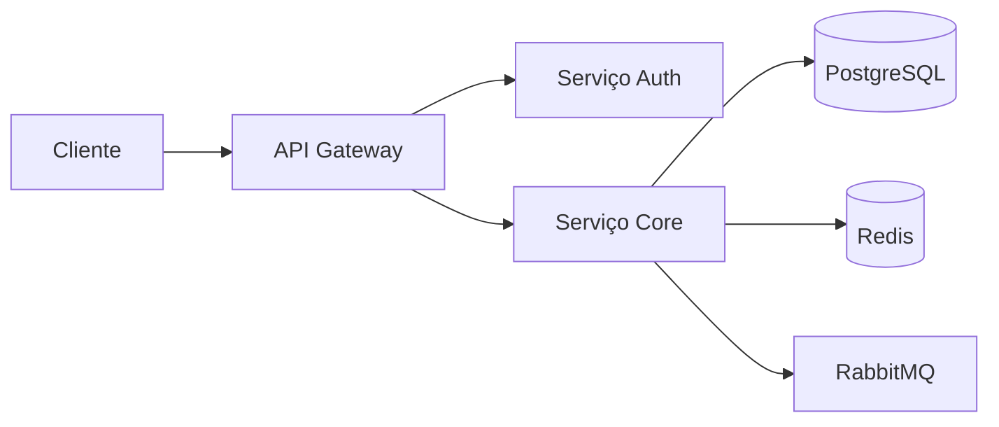

# Relatórios de vendas

**Produto:** AIRich CRM | **Departamento:** Produtos | **Data:** 2026-09-15 | **Versão:** 2.8

---

## Índice

1. Visão Geral
2. Arquitetura
3. Procedimentos
4. Infraestrutura
5. Troubleshooting
6. Segurança
7. Métricas
8. Referências

---

## Visão Geral

Este documento fornece uma visão detalhada sobre Relatórios de vendas no ecossistema AIRich.

O investimento contínuo em Relatórios de vendas reflete o compromisso da AIRich com a entrega de soluções de alta qualidade que atendam às demandas do mercado brasileiro e internacional.

## Arquitetura

## Procedimentos

O procedimento padrão para esta atividade segue as seguintes etapas:

1. **Identificação** — Reconhecer o escopo e os requisitos necessários
2. **Planejamento** — Definir recursos, cronograma e responsabilidades
3. **Execução** — Implementar conforme as especificações técnicas
4. **Validação** — Verificar se os resultados atendem aos critérios de aceite
5. **Documentação** — Registrar todas as ações e decisões tomadas

## Infraestrutura

| Métrica | Meta | Atual | Tendência |
|------|------|-------|----------|
| Disponibilidade | 99.95% | 99.97% | ↑ |
| Latência P95 | < 200ms | 156ms | ↓ |
| Taxa de Erro | < 0.1% | 0.05% | ↓ |
| Throughput | 10K req/s | 12.5K req/s | ↑ |

## Troubleshooting

### Problema: Falha na execução

**Sintoma:** O processo apresenta erro inesperado durante a execução.

**Causas possíveis:**
- Configuração incorreta do ambiente
- Dependência externa indisponível
- Limite de recursos atingido

**Solução:**
1. Verificar logs do sistema
2. Confirmar conectividade com serviços dependentes
3. Reiniciar o serviço se necessário
4. Escalar para o time de SRE se o problema persistir

## Segurança

- **Transporte:** TLS 1.3 obrigatório para todas as comunicações
- **Autenticação:** JWT com rotação automática de chaves
- **Autorização:** RBAC com granularidade por recurso
- **Auditoria:** Log imutável de todas as operações sensíveis
- **Criptografia:** AES-256 para dados sensíveis em repouso

## Métricas de Qualidade

| Indicador | Meta | Atual | Status |
|-----------|------|-------|--------|
| Cobertura de testes | > 80% | 85% | ✅ |
| Densidade de bugs | < 0.1% | 0.05% | ✅ |
| Tempo de resposta | < 200ms | 156ms | ✅ |
| Satisfação do cliente | > 90% | 92.3% | ✅ |

## Histórico de Versões

| Versão | Data | Autor | Descrição |
|--------|------|-------|-----------|
| 1.0 | 2026-01-15 | Equipe Produtos | Versão inicial |
| 1.1 | 2026-03-22 | Equipe Produtos | Correções e melhorias |
| 2.0 | 2026-05-01 | Equipe Produtos | Revisão completa |

## Referências

1. Documentação interna AIRich — Confluence
2. Guia de arquitetura AIRich v3.0
3. Manual de operações — Runbook Master
4. Políticas de desenvolvimento AIRich
5. ISO 27001:2022 — Segurança da Informação

---

*Documento mantido pela equipe de Produtos — AIRich Tecnologia*
