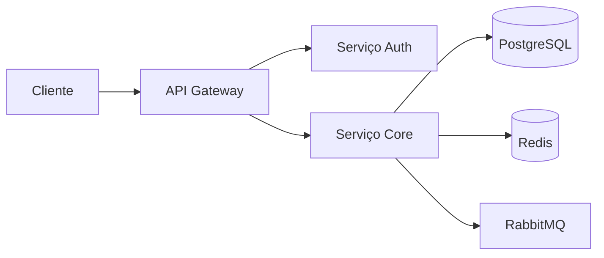

# Grafana dashboards

**Produto:** AIRich DevOps Suite | **Departamento:** Produtos | **Data:** 2026-04-19 | **Versão:** 2.2

---

## Índice

1. Visão Geral
2. Arquitetura
3. Procedimentos
4. Infraestrutura
5. Troubleshooting
6. Segurança
7. Métricas
8. Referências

---

## Visão Geral

A seguir, apresentamos as diretrizes e procedimentos relacionados a Grafana dashboards.

A evolução constante do ecossistema AIRich demanda processos bem definidos. Grafana dashboards foi documentado para orientar as equipes técnicas e operacionais na execução de suas atividades.

## Arquitetura

## Procedimentos

Para executar este processo corretamente:

1. Verificar pré-requisitos e dependências
2. Aplicar o procedimento conforme documentação técnica
3. Validar resultados com a equipe responsável
4. Atualizar a documentação com eventuais mudanças
5. Comunicar stakeholders sobre o status

## Infraestrutura

| Ambiente | URL | Status | Responsável |
|---------|-----|--------|-----------|
| Produção | app.airich.com | Ativo | SRE |
| Staging | staging.airich.com | Ativo | DevOps |
| Dev | dev.airich.com | Ativo | Engenharia |
| QA | qa.airich.com | Ativo | QA Lead |

## Troubleshooting

### Problema: Falha na execução

**Sintoma:** O processo apresenta erro inesperado durante a execução.

**Causas possíveis:**
- Configuração incorreta do ambiente
- Dependência externa indisponível
- Limite de recursos atingido

**Solução:**
1. Verificar logs do sistema
2. Confirmar conectividade com serviços dependentes
3. Reiniciar o serviço se necessário
4. Escalar para o time de SRE se o problema persistir

## Segurança

- **Transporte:** TLS 1.3 obrigatório para todas as comunicações
- **Autenticação:** JWT com rotação automática de chaves
- **Autorização:** RBAC com granularidade por recurso
- **Auditoria:** Log imutável de todas as operações sensíveis
- **Criptografia:** AES-256 para dados sensíveis em repouso

## Métricas de Qualidade

| Indicador | Meta | Atual | Status |
|-----------|------|-------|--------|
| Cobertura de testes | > 80% | 85% | ✅ |
| Densidade de bugs | < 0.1% | 0.05% | ✅ |
| Tempo de resposta | < 200ms | 156ms | ✅ |
| Satisfação do cliente | > 90% | 92.3% | ✅ |

## Histórico de Versões

| Versão | Data | Autor | Descrição |
|--------|------|-------|-----------|
| 1.0 | 2026-01-15 | Equipe Produtos | Versão inicial |
| 1.1 | 2026-03-22 | Equipe Produtos | Correções e melhorias |
| 2.0 | 2026-05-01 | Equipe Produtos | Revisão completa |

## Referências

1. Documentação interna AIRich — Confluence
2. Guia de arquitetura AIRich v3.0
3. Manual de operações — Runbook Master
4. Políticas de desenvolvimento AIRich
5. ISO 27001:2022 — Segurança da Informação

---

*Documento mantido pela equipe de Produtos — AIRich Tecnologia*
