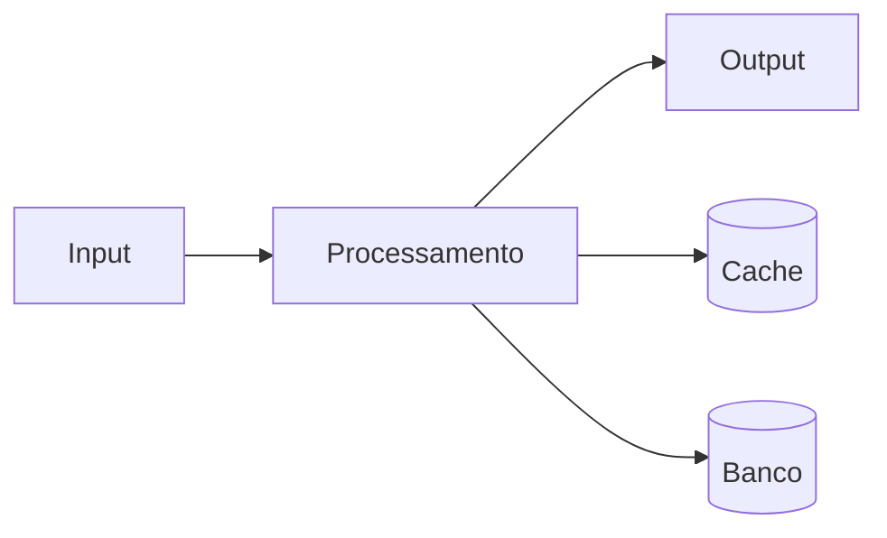

# Economic buyer

**Produto:** Vendas | **Departamento:**  | **Data:** 2026-07-09 | **Versão:** 2.4

---

## Índice

1. Visão Geral
2. Arquitetura
3. Procedimentos
4. Infraestrutura
5. Troubleshooting
6. Segurança
7. Métricas
8. Referências

---

## Visão Geral

Este documento fornece uma visão detalhada sobre Economic buyer no ecossistema AIRich.

A evolução constante do ecossistema AIRich demanda processos bem definidos. Economic buyer foi documentado para orientar as equipes.

## Arquitetura

## Procedimentos

Para executar corretamente:

1. Verificar pré-requisitos
2. Aplicar o procedimento
3. Validar resultados
4. Atualizar documentação
5. Comunicar stakeholders

## Infraestrutura

| Métrica | Meta | Atual | Tendência |
|------|------|-------|----------|
| Disponibilidade | 99.95% | 99.97% | ↑ |
| Latência P95 | < 200ms | 156ms | ↓ |
| Taxa de Erro | < 0.1% | 0.05% | ↓ |
| Throughput | 10K/s | 12.5K/s | ↑ |

## Troubleshooting

### Problema: Falha na execução

**Sintoma:** Erro inesperado durante o processo.

**Causas:** Configuração incorreta, dependência indisponível, limite de recursos.

**Solução:**
1. Verificar logs
2. Confirmar conectividade
3. Reiniciar se necessário
4. Escalar para SRE

## Segurança

- **Transporte:** TLS 1.3 obrigatório
- **Autenticação:** JWT com rotação de chaves
- **Autorização:** RBAC granular
- **Auditoria:** Log imutável
- **Criptografia:** AES-256

## Métricas de Qualidade

| Indicador | Meta | Atual | Status |
|-----------|------|-------|--------|
| Cobertura de testes | > 80% | 85% | ✅ |
| Densidade de bugs | < 0.1% | 0.05% | ✅ |
| Tempo de resposta | < 200ms | 156ms | ✅ |
| Satisfação | > 90% | 92.3% | ✅ |

## Histórico de Versões

| Versão | Data | Autor | Descrição |
|--------|------|-------|-----------|
| 1.0 | 2026-01-15 | Equipe  | Versão inicial |
| 1.1 | 2026-03-22 | Equipe  | Correções |
| 2.0 | 2026-05-01 | Equipe  | Revisão completa |

## Referências

1. Documentação interna AIRich
2. Guia de arquitetura v3.0
3. Manual de operações
4. Políticas de desenvolvimento

---

*Documento mantido pela equipe de  — AIRich Tecnologia*
