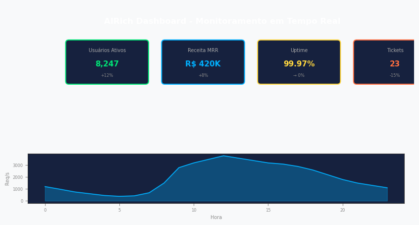

# Alerta: Replication lag

**Produto:** Infraestrutura | **Departamento:**  | **Data:** 2026-02-07

---

## Visão Geral

O presente documento tem como objetivo apresentar Alerta: Replication lag para as equipes envolvidas.

A equipe da AIRich trabalha continuamente na evolução de Alerta: Replication lag, incorporando feedback e avanços tecnológicos.

## Procedimento

Etapas recomendadas:

| Etapa | Responsável | Prazo |
|-------|------------|-------|
| Análise | Equipe Técnica | 2 dias |
| Implementação | Desenvolvedor | 5 dias |
| Testes | QA | 3 dias |
| Aprovação | Tech Lead | 1 dia |

## Infraestrutura

| Métrica | Meta | Atual | Tendência |
|------|------|-------|----------|
| Disponibilidade | 99.95% | 99.97% | ↑ |
| Latência P95 | < 200ms | 156ms | ↓ |
| Taxa de Erro | < 0.1% | 0.05% | ↓ |
| Throughput | 10K/s | 12.5K/s | ↑ |

---

*Documento mantido pela equipe de  — AIRich Tecnologia*
