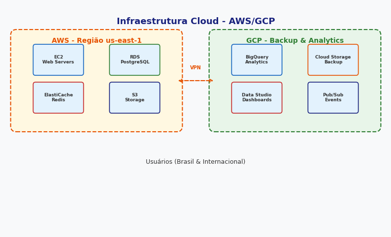

# Servidor: cache-01

Esta especificação técnica define os requisitos e procedimentos para Servidor: cache-01.

Alinhado com as melhores práticas do mercado, Servidor: cache-01 segue padrões estabelecidos pelas equipes da AIRich Tecnologia.

Para mais informações, consulte a documentação da AIRich.